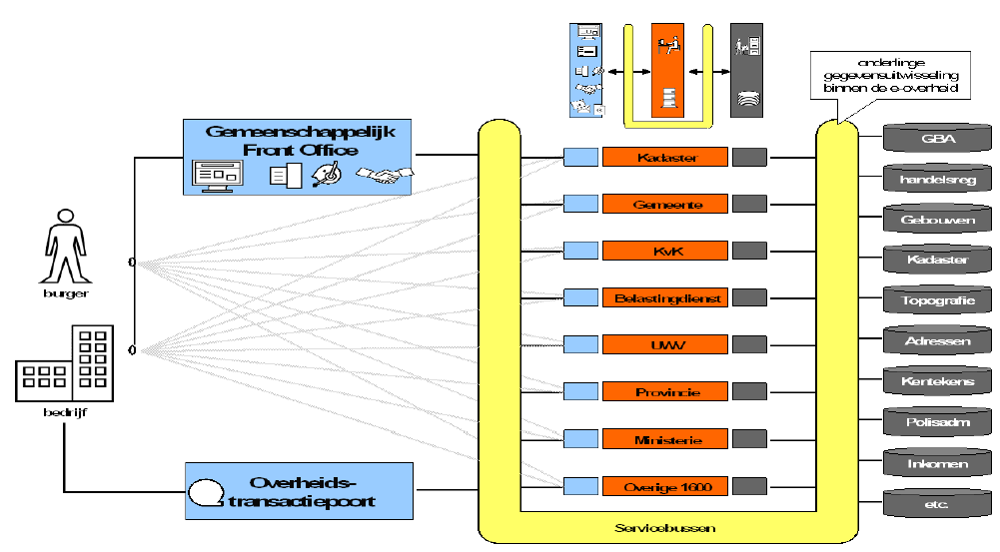
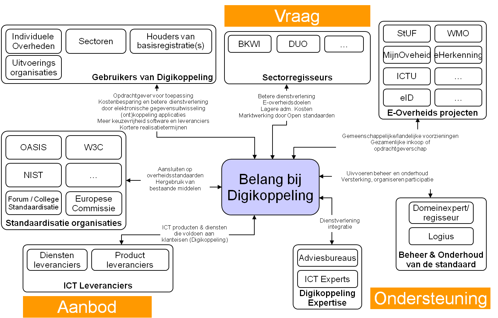
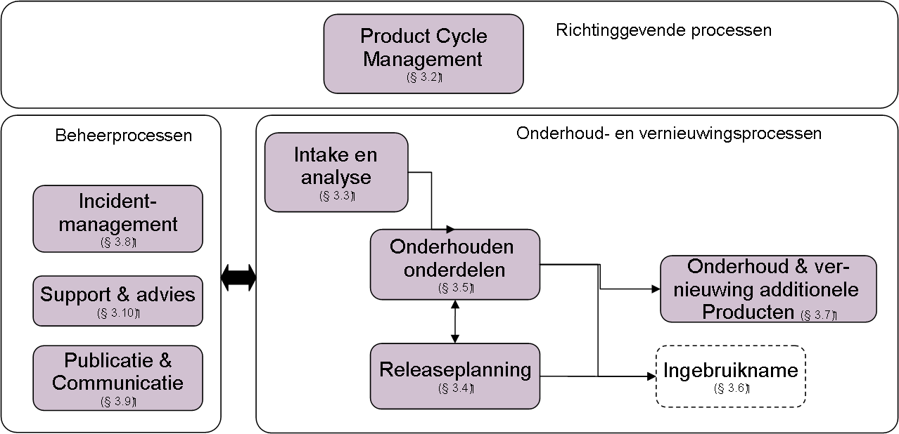
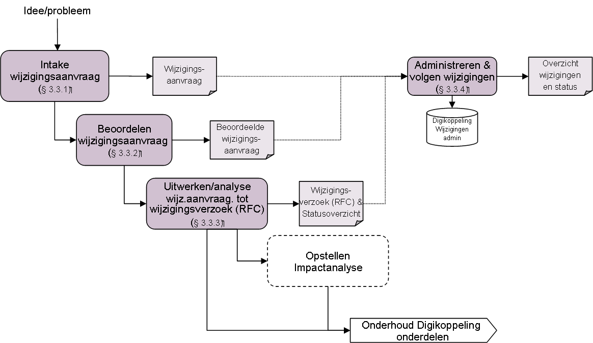
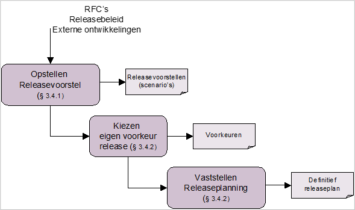
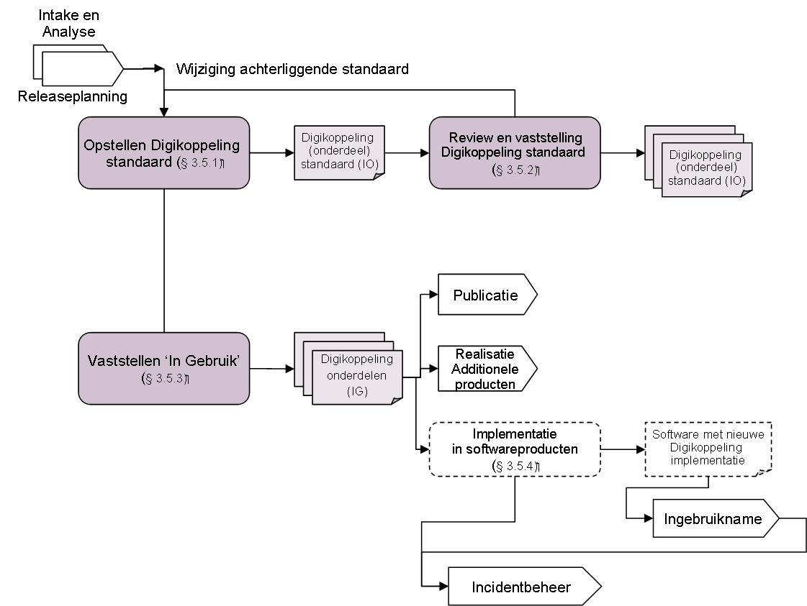
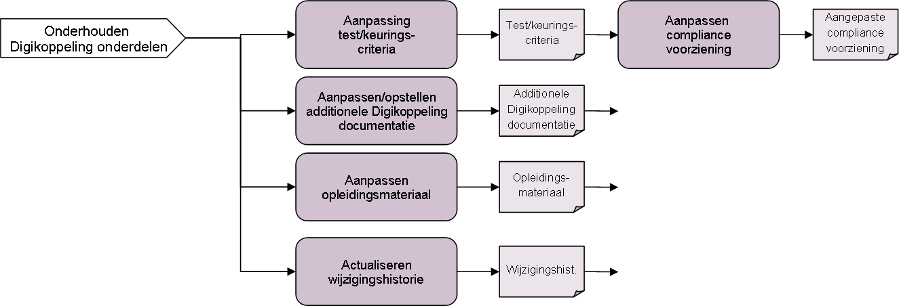
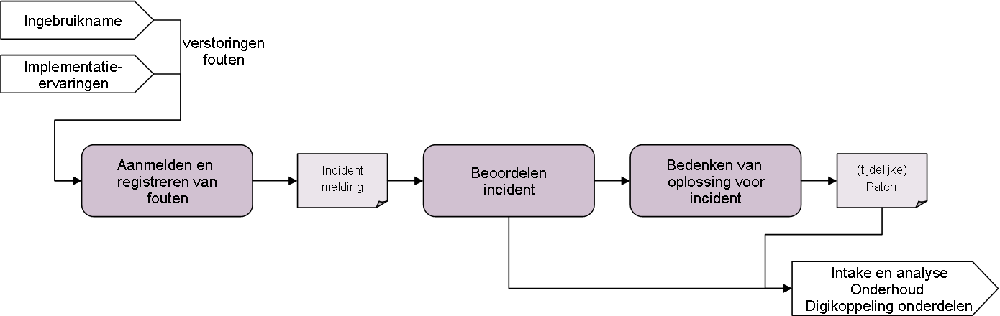
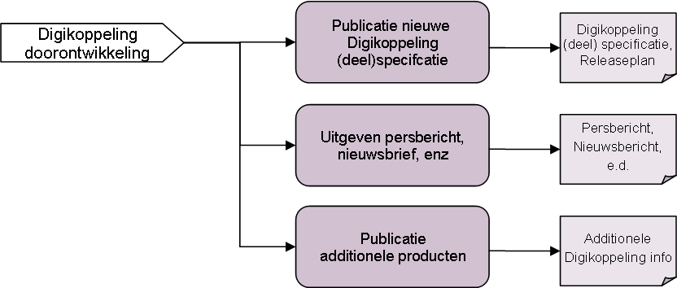

# Inleiding

<aside class="note">

Dit document is op een aantal delen verouderd. 

- Na het vertrek van de `Digicommissaris` in 2018, en daarmee de `Regieraden` en het `Afnemersoverleg Stelseldiensen` zijn er gremia opgericht die hun rol konden vervangen. Er wordt echter op dit moment gewerkt aan een bestuursoverleg over Standaarden. Logius Beheer Digikoppeling wacht deze ontwikkeling af en zal dit document aanpassen als hierover meer duidelijkheid bestaat.
- Sommige wijzigingen en ontwikkelingen binnen de DIgikoppeling standaarden worden nog niet vermeld.
- Sommige begrippen, afbeeldingen en referenties in dit document zijn verouderd of tonen een situatie die inmiddels is gewijzigd.

</aside>

## Achtergrond

De Nederlandse Overheid Referentie Architectuur (NORA) positioneert Digikoppeling als de logistieke laag voor standaardisatie van communicatie tussen systemen bij overheidsorganisatie op basis van webservice standaarden. Digikoppeling is daardoor een laag die zich bevindt tussen het transportnetwerk (b.v. Diginetwerk of Internet) en de applicatielaag (functionele berichtinhoud). De systemen die Digikoppeling gebruiken zijn zowel frontoffice-systemen (die interactie met burgers en bedrijven afhandelen) als systemen van andere overheden en in het bijzonder de basisregistraties (zie onderstaand figuur).

Doel van Digikoppeling is om door vergaande standaardisatie de interoperabiliteit tussen overheden te bevorderen. Als de 'envelop' van de 'berichten' is gestandaardiseerd kan ieder voorzieningen voor postverzending inrichten die onafhankelijk zijn van de berichten in de 'envelop'.

De Digikoppeling standaard is door het College Standaardisatie1 in november 2007 geselecteerd als standaard voor het Comply-or-Explain regime en in mei 2009 opnieuw bekrachtigd. Het College stelde ook als eis dat een beheerproces voor een goed te keuren standaard is ingericht. Dit document beschrijft deze inrichting.

1: Het College Standaardisatie is begin 2018 voortgezet in het Overheidsbreed Beleidsoverleg Digitale Overheid (OBDO).

De Digikoppeling-standaard is binnen de overheid in gebruik bij diverse organisaties, samenwerkingsverbanden en/of ketens. Een groot aantal ICT leveranciers biedt ondersteuning aan de voor Digikoppeling benodigde open standaarden (WUS, ebMS, https) in hun producten en dienstverlening. De Digikoppeling standaard heeft de zich afgelopen tijd ontwikkeld tot een volwassen standaard die in een grote en brede community wordt ontwikkeld. Bij het beheer van de Digikoppeling-standaard zijn veel verschillende organisaties betrokken uit de gehele eOverheid. De voornaamste organisaties zijn ministeries, Manifestpartijen, houders van basisregistraties en landelijke voorzieningen, ketenpartijen, ICT leveranciers en gemeenten via KING. Opdrachtgever voor Digikoppeling is het Ministerie van BZK.

Omdat de Digikoppeling standaard steeds meer en breder wordt gebruikt, is het noodzakelijk dat het beheer en onderhoud voor alle belang-hebbenden inzichtelijk en transparant is, duidelijk belegd is en de doorontwikkeling releasematig plaatsvindt. Dit document geeft hier invulling aan en beschrijft het beheermodel voor de Digikoppeling-standaarden.

In dit beheermodel komen de volgende onderwerpen aan bod:

- Scope van het beheer, de te beheren objecten van Digikoppeling;

- Releasebeleid;

- Organisatie, participatievormen, processen voor het beheer en onderhoud;

- Informatievoorziening t.b.v. belanghebbenden inclusief communicatie en publicatie.

Voor het opstellen van dit document is zoveel mogelijk aangesloten bij het beheermodel van StUF om de eenvormigheid van beheerprocessen bij de eOverheid te bevorderen.

## Doel van document 

Dit document beschrijft het beheermodel voor de Digikoppeling-standaarden. Het geeft alle belanghebbenden inzicht in het releasebeleid, in de wijze waarop het beheer van Digikoppeling is belegd, hoe het proces van wijzigen en releaseplanning van de Digikoppeling standaard eruit ziet en hoe de besluitvorming en participatie is georganiseerd. Daarnaast komen aanvullende onderwerpen aan de orde zoals release-nummering en de publicatie en informatievoorziening rond Digikoppeling.

Door dit inzicht kunnen de belanghebbenden beter rekening houden met en gebruik maken van de Digikoppeling standaard. Voor sommige belanghebbenden, zoals basisregistraties en andere informatieleveranciers binnen de eOverheid, is dit beheermodel van belang voor de planning van hun ontwikkeling en onderhoud. Maar ook ICT-leveranciers zullen, ieder op hun eigen manier, rekening moeten houden met het beheermodel om ondersteuning te kunnen leveren aan de betrokken overheidsorganisaties.

In Hoofdstuk 2 is het beheer op hoofdlijnen beschreven. Daarin komen aan de orde: de afbakening van het beheer; de verschillende belanghebbenden; de structuur van participatie en ondersteuning en het releasebeleid.

In Bijlage A zijn de beheer- en onderhoudsprocessen beschreven; in Bijlage B de informatievoorziening rond de Digikoppeling standaard en in Bijlage C het gehanteerde begrippenkader. Tot slot komt in Bijlage D en E een aantal overige onderwerpen aan de orde.

## Doelgroep van dit document

| Afkorting | Rol                             | Taak                                                                                                       | Doelgroep? |
|-----------|---------------------------------|------------------------------------------------------------------------------------------------------------|------------|
| [MT]      | Management                      | Bevoegdheid om namens organisatie (strategische) besluiten te nemen.                                       | **Ja**     |
| [PL]      | Projectleiding                  | Verzorgen van de aansturing van projecten.                                                                 | **Ja**     |
| [A&D]     | Analyseren & ontwerpen (design) | Analyseren en ontwerpen van oplossings-richtingen. Het verbinden van Business aan de IT.                   | **Ja**     |
| [OT&B]    | Ontwikkelen, testen en beheer   | Ontwikkelt, bouwt en configureert de techniek conform specificaties. Zorgen voor beheer na ingebruikname.  | **Ja**     |

## Bijdragen 

Onderstaande personen hebben bijgedragen aan de totstandkoming van dit beheermodel:

- Tom Peelen, Logius stelselarchitect

- Peter Klaver, EGEM i-teams

- Peter Leijnse, Logius

- Egon Velders, BKWI

- Frans van Diepen, LNV

- Marcel Reuvers, GeoNovum

In de review-fase van het beheermodel is een belangrijke bijdrage geleverd door de volgende leden van het Technisch Overleg Digikoppeling:

- Sylvia Majdoubi, Kamers van Koophandel,

- Hans Lussing, ICTU/OverheidsDienstenPlatform,

- Paul Schlotter Logius,

- Jan Moggré, UWV,

- Bram Gaakeer, ministerie van OCW,

- Tom Vijlbrief, Kadaster,

- Maarten van den Broek, Waarderingskamer,

- Frans van Diepen, ministerie van LNV,

- Geurt-Jan van Renswoude, ICTU/eFormulieren,

- Hugo Heitmeijer, Belastingdienst,

- Tom Peelen, Logius stelselarchitect

Bij de toetsing met Bomos2i is een belangrijke bijdrage geleverd door:

- Marijke Salters, Logius Centrum voor Standaarden

- Lia van der Knijff, Logius projectleider Digikoppeling

- Tom Peelen, Logius stelselarchitect

## Licentie en patentrechten 

Dit werk is gelicenseerd onder een Creative Commons Naamsvermelding 3.0 Unported licentie.

Meer informatie over de precieze voorwaarden van deze licentie vindt u op de website van Creative Commons http://creativecommons.nl/ en specifiek voor deze licentie een samenvatting onder http://creativecommons.org/licenses/by/3.0/deed.nl en de volledige licentietekst onder http://creativecommons.org/licenses/by/3.0/legalcode.

Dit werk en de specificaties van de Digikoppeling-standaard worden royaltee-free ter beschikking gesteld. Organisaties en personen die bijdragen aan Digikoppeling dienen hun bijdragen vrij te geven zodanig dat hieraan voldaan kan worden. Door bij te dragen aan Digikoppeling verklaren zij hiermee in te stemmen.

Uitgesloten van alle bovenstaande zijn rechten verbonden aan de standaarden, profielen en andere onderdelen waar Digikoppeling gebruik van maakt. Hierop zijn de rechten van de betreffende standaarden, profielen en andere onderdelen zelf van toepassing.

# Digikoppeling Beheer en onderhoud op hoofdlijnen

## Scope beheer 

Het beheer van de Digikoppeling-standaard omvat het geheel van processen, besturing, organisatie, informatievoorziening en hulpmiddelen die noodzakelijk zijn om gebaseerd op open standaarden ook Digikoppeling zelf als open standaard in stand te houden, te onderhouden en door te ontwikkelen.

De Digikoppeling is beschreven in een set van documenten. Deze set is als volgt opgebouwd:

Alle met de kleur groen aangegeven documenten vallen onder het beheer zoals geformaliseerd in het Beheermodel en releasebeleid.

De Nederlandse Overheid Referentie Architectuur (NORA) maakt geen deel uit van het in dit document beschreven beheer van de Digikoppeling-standaard, maar bevat wel belangrijke informatie over Digikoppeling en haar toepassing.

De Digikoppeling Koppelvlakstandaarden bevatten meerdere profielen waarin een samenhangend interactiepatroon voor berichtuitwisseling is beschreven2.

2: Een Digikoppeling service (Service Provider en Service Requester) werkt altijd volgens een vooraf bepaald profiel voor berichtenuitwisseling volgens een Koppelvlakstandaard.

"Gebruik en achtergrond Digikoppeling-certificaten" en de Best Practice documenten zullen blijvend beheerd worden, maar volgens afwijkende procedures. Deze documenten vereisen niet dezelfde strikte besluitvorming aangezien zij een toelichting vormen bij de Koppelvlakstandaarden en architectuur.

Het beheer heeft ook betrekking op de bij de Digikoppeling-familie behorende documenten, bestanden en voorzieningen, zoals nieuws en persberichten, factsheets, presentaties, opleidingsmateriaal, relatiegegevens van Digikoppeling participanten. Het beheer hiervan vraagt echter ook een minder formele besluitvormingsprocedure.

Bij de Digikoppeling horen de volgende ondersteunende hulpmiddelen en ICT voorzieningen:

- Digikoppeling OIN Register en het hieraan gekoppelde CPA-register ,

- Digikoppeling Compliance Voorzieningen (WUS, ebMS2, grote berichten),

Het beheer over deze voorzieningen is in bestaande beheerprocedures van Logius ondergebracht.

## Belanghebbenden 

Veel verschillende partijen hebben direct dan wel indirect belang bij de ontwikkeling, de implementatie en het gebruik van de Digikoppeling-standaard. Dit geldt dus ook voor het beheer en onderhoud ervan. In onderstaand schema zijn de belanghebbenden aangegeven.

De Digikoppeling standaard wordt in stand gehouden en doorontwikkeld door participatie van de belanghebbenden. Ruwweg zijn drie rollen te onderkennen, de vraagkant, de aanbodkant en de ondersteuningskant:

- De vraagkant bestaat uit organisaties die Digikoppeling koppelingen gebruiken voor de eigen informatievoorziening, sectoren die Digikoppeling gebruiken als standaard voor (keten)integratiedoeleinden en e-overheidsprojecten die Digikoppeling toepassen.

- De aanbodkant bestaat uit ICT leveranciers die de producten maken voor ondersteuning van de open standaarden waarop Digikoppeling is gebaseerd (adapter-leveranciers of diensten-leveranciers). Onder de aanbodkant rekenen we ook standaardisatie-organisaties (OASIS, W3C e.d.) waar de standaarden waarop Digikoppeling is gebaseerd vandaan komen.

- De ondersteuningskant bestaat uit de beheerders van de Digikoppeling-standaarden en beheerders van de Digikoppeling-voorzieningen. Expertise voor Digikoppeling is ook verkrijgbaar in de markt.

Afhankelijk van eigen doelstellingen, verantwoordelijkheden en belangen zullen belanghebbenden op een andere wijze participeren.

## Structuur van participatie en ondersteuning 

In het beheer van Digikoppeling kunnen belanghebbenden participeren in vier vormen:

1. Digikoppeling Community,

2. Digikoppeling Technisch Overleg,

3. ~~Klantenraad gegevens, (hoogambtelijk) Overheidsbreed Beleidsoverleg Digitale Overheid (OBDO)~~

In deze groepen zijn de diverse rollen uit de vraagkant, aanbodkant en de ondersteuningskant vertegenwoordigd. De participatie beperkt zich tot de eerder beschreven scope en omvat geen (Digikoppeling-)voorzieningen.

| Participatievorm                                     | Accent              | Rol participant                                                                                                                                                                                                                                        | Ondersteuning door beheerder                                                                                                                                                                                     |
|------------------------------------------------------|---------------------|--------------------------------------------------------------------------------------------------------------------------------------------------------------------------------------------------------------------------------------------------------|------------------------------------------------------------------------------------------------------------------------------------------------------------------------------------------------------------------|
| Digikoppeling Community                              | Vrij, geen accent   | Volgen van en interacteren met Digikoppeling ontwikkelingen                                                                                                                                                                                            | Beantwoorden supportvragen Beheren community  Optreden als moderator                                                                                                                                             |
| Digikoppeling Technisch Overleg (min. 2x per jaar)   | Inhoud              | Samen met andere experts: Inhoudelijk ontwikkelen van Digikoppeling onderdelen en bijbehorende documentatie Voorbereiden van de release-planning                                                                                                       | Analyseren, ontwerpen en uitwerken van specificaties Volgen en beïnvloeden van aanpalende standaarden Organiseren bijeenkomsten Opstellen en verspreiden notulen Beschikbaar stellen Digikoppeling specificaties |
| ~~Klantenraad Gegevens uitwisseling~~                    | Prioritering proces | Samen met andere participanten: Prioriteiten stellen voor de ontwikkeling, roadmap van nieuwe releases van Digikoppeling koppelvlak standaarden Vaststellen roadmap van de standaard. Voorportaal OBDO Vaststellen Digikoppeling *minor* releases3  | Analyseren, ontwerpen en uitwerken van beleidszaken, (release)planning, versterkingen  Secretariaat Klantenraad                                                                                                  |
| ~~OBDO~~                                                 | Bestuurlijk besluit | Samen met andere bestuurders: Vaststellen Digikoppeling *major* releases3  Vaststellen beheermodel van de standaard. Vaststellen externe publicaties over Digikoppeling beleid en releases                                                             | Doorgeleiding van de Klantenraad en inbreng via secretariaat OBDO  Publiceren Digikoppeling standaard en andere Digikoppeling-informatie                                                                         |

3: Zie bijlage D voor meer informatie over versionering.

Het OBDO de Klantenraad gegevens worden geacht in hun besluiten het belang van gebruik van Digikoppeling in het gehele organisatorische werkingsgebied mee te wegen.

## Releasebeleid 

De te beheren Digikoppeling standaard en haar onderdelen zullen zowel gezamenlijk als elk afzonderlijk onderhevig zijn aan beheer en onderhoud. Het beleid dat gehanteerd wordt voor aanpassingen van de Digikoppeling is als volgt:

**Participatie**

1. Uitbreidingen en aanpassingen in (een onderdeel van) de Digikoppeling-standaard komt tot stand door participatie van de verschillende belanghebbenden.

2. Belanghebbenden kunnen op vier manieren participeren: als lid van de Digikoppeling Community en/of het Digikoppeling Technisch Overleg en/of als lid van de Klantenraad gegevensuitwisselingen/of als lid van het OBDO.

3. Deelname aan de Digikoppeling-Community staat open voor alle belanghebbenden; deelname aan het Digikoppeling Technisch Overleg vindt plaats na goedkeuring door Logius4; deelname aan de Klantenraad staat open voor alle overheidsorganisaties. Deelname aan het OBDO is bepaald in het instellingsbesluit van het OBDO5.

4. De samenstelling van de overleggen dient zodanig te zijn dat de eigenaar van de Standaard (MinBZK) deze als gezaghebbend beschouwt.

4: Logius kijkt hierbij of de belangstellende partij ook een belanghebbende partij is.

5: https://zoek.officielebekendmakingen.nl/stcrt-2018-9728.html

**Nieuwe releases**

1. De Digikoppeling-standaard dient in principe zo stabiel te zijn dat nieuwe releases van de standaard bestaande implementaties van een oudere release niet tot migratie verplichten.

2. Nieuwe releases van de standaard dienen als nieuwe profielen binnen een Koppelvlakstandaard naast de bestaande profielen gerealiseerd te worden (uitbreiding). Indien dit niet mogelijk is wordt gestreefd naar het interoperabel (engels: backwards compatible) zijn van profielen met voorgaande releases (interoperabele verandering). Bij wijzigingen waarin ook dit niet mogelijk is, vindt een expliciete afweging plaats van de geboden verbetering ten opzichte van het belang van bestaande implementatie (beperking impact).

3. Wijzigingsaanvragen kunnen door belanghebbenden worden ingediend bij de beheerder.

4. Het Digikoppeling Technisch Overleg is verantwoordelijk voor de beoordeling van ingediende wijzigingsaanvragen, uitwerken ervan in RFC’s en de inhoudelijke (door)ontwikkeling van de te beheren Digikoppeling-onderdelen.

5. De Digikoppeling-beheerder zorgt voor de voorbereiding van de releaseplanning.

6. De klantenraad gegevensuitwisseling beoordeelt de releasevoorstellen en stelt het beleid en de roadmap6 van nieuwe releases van de Digikoppeling-standaard vast in het releaseplanningsproces.

7. Bij het vaststellen van de inhoud van een nieuwe release van een Digikoppeling onderdeel wordt gestreefd naar consensus in de klantenraad . Als consensus uitblijft zal de Digikoppeling beheerder, samen met het Ministerie van BZK de inhoud van een nieuwe release vaststellen.

8. Bij het vaststellen van een nieuwe release zal de klantenraadook uitspraken doen over het ondersteunen van oude releases.

9. Maximaal kunnen twee (opéénvolgende) releases van een Digikoppeling onderdeel gelijktijdig de status „In Gebruik‟ hebben7.

10. De releasetermijnen voor de verschillende Digikoppeling-onderdelen zijn afgestemd op de omgeving waarin deze worden gebruikt. Koppelvlak standaarden hebben bijvoorbeeld een kortere releasetermijn dan de bovenliggende Architectuur. De releasetermijnen staan opgesomd in paragraaf 3.4.1.

11. In bijzondere gevallen kan van de releasetermijn worden afgeweken. Deze gevallen zijn verbijzonderd in paragraaf 3.4.1.

12. Op het moment dat het functionele toepassingsgebied van Digikoppeling, waarvoor het pas-toe-of-leg-uit- regime geldt, wijzigd, wordt dit voorgelegd aan Forum Standaardisatie & het OBDO zodat het regime kan worden bekrachtigd voor dit nieuwe toepassingsgebied.

6: De releasekalender is te vinden op [www.e-overheid.nl](http://www.e-overheid.nl).

7: Het streven is dat een nieuw release uitsluitend uitbreidingen ten opzichte van de vorige release bevat. Daardoor voldoen implementaties van de oude release automatisch ook aan deze nieuwe release. In dit geval zal alleen de nieuwe release de status 'In Gebruik' krijgen.

**Aansluiting op andere standaarden**

Digikoppeling sluit aan op onderstaande standaarden. De aansluiting vindt plaats binnen de vastgestelde releasetermijnen van de Digikoppeling onderdelen.

1. Digikoppeling volgt de ontwikkeling van internationale standaarden (zoals W3C en OASIS) in het algemeen en die voor de daarin opgenomen standaarden zoals WUS, ebMS en http in het bijzonder.

2. De Digikoppeling-standaard volgt de Nederlandse Overheid Referentie Architectuur (NORA).

3. De Digikoppeling-standaard en in het bijzonder "Gebruik en achtergrond Digikoppeling-certificaten" sluiten aan bij de PKI.Overheid.

**Publicatie**

1. De Digikoppeling beheerder zal na besluitvorming in de klantenraad de Roadmap en de specificaties van de betreffende Digikoppeling onderdelen publiceren.

2. De beheerder zal zich inspannen om een publicatie van een nieuwe release van de Digikoppeling Koppelvlak standaarden binnen enkele maanden te laten volgen door beschikbaar komen van nieuwe Compliance Voorzieningen.

3. In de publicatie wordt per Digikoppeling onderdeel onderscheid gemaakt in vier statussen van ontwikkeling. De te onderscheiden statussen zijn:

| **Afkorting** | **Status van een Digikoppeling onderdeel** | **Beschrijving van de status**                                                                                                                                                                                                                                                                             |
|---------------|--------------------------------------------|------------------------------------------------------------------------------------------------------------------------------------------------------------------------------------------------------------------------------------------------------------------------------------------------------------|
| IO            |  In Ontwikkeling                           | Een (nieuwe release van een) Digikoppeling onderdeel is “In Ontwikkeling” wanneer er met medeweten en medewerking van participanten aan gewerkt wordt en wanneer dit onderdeel of deze release nog niet voor de buitenwereld is gepubliceerd.                                                              |
| IG            |  In Gebruik                                | Als een (nieuwe release van een) Digikoppeling onderdeel gereed is, stellen het Digikoppeling Technisch Overleg en de Klantenraad de status ‘In Gebruik’ vast. Door deze vaststelling worden gebruikers en ICT-leveranciers opgeroepen deze nieuwe release op te nemen in software en in gebruik te nemen. |
| EO            |  Einde Ondersteuning                       | Het Digikoppeling onderdeel met de status “Einde ondersteuning” wordt niet meer ondersteund door de Digikoppeling beheerder. De kennis en informatie voor vragen en support is bij de beheerder niet langer beschikbaar.                                                                                   |
| TG            |  Teruggetrokken                            | Een Digikoppeling onderdeel krijgt de status “Teruggetrokken” indien een release van een Digikoppeling onderdeel niet bruikbaar blijkt (bijv. vanwege implementatieproblemen).                                                                                                                             |

**Implementatie en gebruik**

1. Leveranciers en gebruikers worden geadviseerd de meeste recente release met de Status “In Gebruik” zo spoedig mogelijk in software te implementeren respectievelijk deze toe te passen.

2. De keuze om functionaliteiten wel of niet toe te passen is een verantwoordelijkheid van de gebruiker.

3. Om migraties te vereenvoudigen wordt gebruikers geadviseerd om in hun programma‟s van eisen op te nemen dat applicaties, die gericht zijn op integratie, ten minste twee opeenvolgende Digikoppeling-standaarden gelijktijdig moeten ondersteunen. Het betreft applicaties zoals middleware, brokers, servicebus en distributiesystemen.

**Overige principes**

1. De standaarden die binnen Digikoppeling toegepast worden, voldoen aan de door het Forum Standaardisatie vastgestelde criteria van een open standaard8. Er zijn geen toetredingscriteria van toepassing om te participeren in de ontwikkeling van de open standaarden.

2. Over de open standaarden inclusief specificaties en andere relevante documenten kan vrijelijk en op royalty-free basis worden beschikt. Alle informatie is daarom beschikbaar op of via de website van de Digikoppeling beheerder en bijdragen aan Digikoppeling door partijen maken dit mogelijk.

3. Er zijn geen beperkingen omtrent het hergebruik van de Digikoppeling-standaarden. Echter, het is niet wenselijk dat er afgeleide dialecten of varianten van de Digikoppeling-standaard ontstaan. Wanneer gebruikers afwijken van de Digikoppeling standaard zullen zij deze afwijkingen conform het pas-toe-of-leg-uitregime voor het Rijk verantwoorden.

4. Het beheer en onderhoud van de Digikoppeling standaard verloopt volgens vastgelegde processen (zie Bijlage A) en informatievoorziening (zie Bijlage B).

8: https://www.forumstandaardisatie.nl/sites/bfs/files/Toetsingsprocedure%20en%20criteria%202.2_0.pdf

# Bijlage A: Beheer- en onderhoudsprocessen

## Procesoverview 

De hoofdprocessen voor het beheer en onderhoud van de Digikoppeling standaard zijn in onderstaande figuur schematisch aangegeven. De hoofdprocessen zijn in de volgende paragrafen nader uitwerkt.

*Noot: gestippelde processen vallen buiten het beheermodel.*

## Proces: Digikoppeling Product Cycle Management 

Digikoppeling kent net als veel andere producten een strategisch proces van Product Cycle Management. Het doel van dit strategische proces is dat de Digikoppeling standaard zowel inhoudelijk als organisatorisch goed aansluit bij de behoefte van de verschillende belanghebbenden.

Jaarlijks wordt een verbeterplan voor de Digikoppeling standaard opgesteld door de beheerder ervan. Op grond van een omgevingsanalyse worden daarvoor nieuwe kansen en mogelijkheden voor het beheerde deel van de Digikoppeling standaard in kaart gebracht. Daarnaast worden de interne verbeterpunten voor de beheerorganisatie en participatievormen in kaart gebracht. De kansen samen met de interne verbeterpunten worden vertaald in een “Digikoppeling jaarplan”.

In dit verbeterplan komen de volgende onderwerpen aan de orde:

- Een geactualiseerd productbeleid, –strategie en –portfolio;

- Aanpassingen aan proces, besluitvorming, participatie en informatievoorziening i.c het beheermodel;

- Organisatorische aanpassingen bij de beheerder of het elders beleggen van het beheer;

- Eventuele behoefte aan en ontwikkeling van nieuwe additionele producten;

- Benodigde middelen (geld, mensen);

- Prioriteren van ontwikkelopdrachten: op welke wijze wordt de beschikbare capaciteit zo efficiënt en effectief mogelijk ingezet.

Het jaarplan voor Digikoppeling maakt deel uit van de jaarplan-cyclus van Logius en wordt gepresenteerd aan eigenaar (beheer en exploitatie) en Klantenraad(doorontwikkeling). Vervolgens wordt het ter goedkeuring aangeboden aan de opdrachtgever van de Digikoppeling beheerder, die de financiële middelen verstrekt voor het uitvoeren van het verbeterplan en de beheeractiviteiten. Momenteel is het Ministerie van BZK de opdrachtgever van de beheerder.

## Proces: Intake en Analyse

### Intake wijzigingsaanvraag 

Een Wijzigingsaanvraag voor een Digikoppeling onderdeel kan ontstaan uit een breed scala van ontwikkelingen of problemen. Ontwikkelingen die van invloed zijn, zijn bijvoorbeeld: ontwikkelingen in de standaardisatie wereld, nieuw beleid, veranderingen in samenwerking of processen, vernieuwing van dienstverlening, veranderingen in basisregistraties of in infrastructuur en ontwikkeling van technologie. Verder zijn problemen uit de praktijk of het hebben van een goed idee aanleiding voor een wijzigingsaanvraag. De aanvraag wordt via mail naar Servicecentrum@logius.nl, telefonisch of direct via contact met een Digikoppeling deskundige van Logius ingediend. Bij voorkeur vult degene van de betrokken partij die het idee, het probleem of aanvraag doet zelf het formulier “Wijzigingsaanvraag” in.

De ideeën of problemen kunnen van verschillende partijen op diverse manieren binnenkomen:

- Gebruikers van Digikoppeling onderdelen,

- Beheerders van Basisregistraties;

- Overleggroepen, tijdens de bijeenkomsten van de overleg- en werkgroepen,

- Projectgroepen met Digikoppeling-gerelateerde dossiers (bijv. Digikoppeling, Stelselorganisatie, NORA, enz.),

- Leden van de Digikoppeling-Community via het Digikoppeling-forum op de website van de Digikoppeling;

- Geregistreerde problemen en fouten vanuit het incident management proces.

Het probleem, de behoefte of het idee wordt beschreven in een Wijzigingsaanvraag. De beheerder registreert deze wijzigingsaanvraag. Elke wijzigingsaanvraag wordt voorzien van een Aanvraagnummer en bijgehouden in een overzicht (b.v. spreadsheet). Deze wordt bewaard in een wijzigingsaanvraag administratie.

Alleen Wijzigingsaanvragen die betrekking hebben op aanpassingen ten opzichte van de meest recente release van een Digikoppeling onderdeel met de status “In Gebruik” worden in behandeling genomen.

### Beoordelen wijzigingsaanvraag 

Een Digikoppeling deskundige van de Digikoppeling beheerder doet een eerste beoordeling of de aanvraag voldoende helder en uitgewerkt is voor verdere behandeling. Zonodig verzamelt hij aanvullende informatie. Hij bepaalt of de betreffende wijzigingsaanvraag in een bijeenkomst van het Digikoppeling Technisch Overleg beoordeeld kan gaan worden. Als een wijzigingaanvraag niet verder in behandeling wordt genomen zal de deskundige dit aan de aanvrager kenbaar maken.

Het Digikoppeling Technisch Overleg beoordeelt vervolgens ook de wijzigingsaanvraag. Digikoppeling Technisch Overleg beslist of de wijzigingsaanvraag uitgewerkt en geanalyseerd moet gaan worden. Daarvoor neemt het Digikoppeling Technisch Overleg per wijzigingsaanvraag een besluit over:

- Het wel of niet analyseren en uitwerken van de wijzigingsaanvraag in een Wijzigingsverzoek (RFC),

- Het wel of niet opstellen van een impactanalyse. Er wordt geen impactanalyse gemaakt als het gaat om het oplossen van fouten of kleine wijzigingen aan een Digikoppeling onderdeel;

- Terugverwijzen, Afwijzen of Uitstellen. Als een wijzigingaanvraag niet verder of later in behandeling kan worden genomen zal dit door de beheerder namens het Digikoppeling Technisch Overleg aan de aanvrager kenbaar worden gemaakt.

### Uitwerken en analyse wijzigingsaanvraag tot RFC 

Een Digikoppeling deskundige analyseert en werkt de wijzigingsaanvraag uit tot een wijzigingsverzoek (RFC). Dit kan een Digikoppeling deskundige zijn van de Digikoppeling beheerder, van een ICT-leverancier, een gemeente of een andere belanghebbende partij. Het resultaat van dit proces is het wijzigingsverzoek.

De Digikoppeling deskundige stuurt het wijzigingsverzoek aan alle leden van het Digikoppeling Technisch Overleg. Het wijzigingsverzoek wordt behandeld in een bijeenkomst van het Digikoppeling Technisch Overleg. De Digikoppeling deskundige die de analyse en uitwerking heeft uitgevoerd, licht de voorgestelde aanpassingen toe. het Digikoppeling Technisch Overleg is eindverantwoordelijk voor de inhoudelijke kwaliteit van het wijzigingsverzoek.

Na behandeling neemt het Digikoppeling Technisch Overleg een besluit over de “status” van het wijzigingsverzoek:

| **Status** |  **Status van een wijzigingsverzoek** | **Omschrijving**                                                                                                             |
|------------|---------------------------------------|------------------------------------------------------------------------------------------------------------------------------|
| N          | Niet uitgewerkt                       | De beginstatus van een wijzigingsverzoek                                                                                     |
| T          | Toestemming voor verdere uitwerking   | het Digikoppeling Technisch Overleg geeft een Digikoppeling deskundige toestemming het RFC uit te werken                     |
| U          | Uitgewerkt                            | Het RFC is door een Digikoppeling deskundige uitgewerkt en is gereed voor behandeling in het Digikoppeling Technisch Overleg |
| O          | Aanpassen en opnieuw behandelen       | Na behandeling in het Digikoppeling Technisch Overleg wordt het RFC aangepast om vervolgens opnieuw te worden behandeld      |
| V          | Voorwaardelijke goedkeuring           | Het RFC is door het Digikoppeling Technisch Overleg onder voorbehoud goedgekeurd                                             |
| G          | Goedgekeurd                           | Het RFC is door het Digikoppeling Technisch Overleg goedgekeurd                                                              |
| A          | Afgewezen                             | Het RFC zal niet (langer) door het Digikoppeling Technisch Overleg in behandeling genomen worden                             |

De status van elk wijzigingsverzoek wordt bijgehouden in een statusoverzicht. In bijlage E is een voorbeeld opgenomen. Het statusoverzicht maakt deel uit van de wijzigingenadministratie.

### Proces: Administratie en ondersteuning 

Dit proces is een ondersteunend proces van het beheer en onderhoud van Digikoppeling. Het bestaat uit:

- Het registreren, bijhouden en het bewaken van de wijzigingsaanvragen;

- Het bijhouden van het statusoverzicht met de wijzigingsverzoeken (zie voorbeeld in bijlage E);

- Het vastleggen en op orde houden van de interne informatievoorziening voor Digikoppeling die bestaat uit:

  - Beheerdocumentatie zoals beheermodel, sjablonen, e.d;

  - Organiseren van bijeenkomsten voor Digikoppeling Technisch Overleg en voorbereiden van Digikoppeling-onderwerpen voor de Klantenraadenhet OBDO;

  - Plannen, (inzet)contracten en overeenkomsten;

  - Afspraken met diverse partijen;

  - Bijhouden van namen, emailadressen, telefoonnummers van de deelnemers van de Digikoppeling Technisch Overleg en leden community, externe deskundigen, en dergelijke;

  - Verslagen van de diverse groepen rond Digikoppeling;

  - Presentaties en documenten over Digikoppeling.

## Proces: Releaseplanning 

De onderdelen van de Digikoppeling standaard en Digikoppeling voorzieningen zullen gezamenlijk en afzonderlijk onderhevig zijn aan beheer en onderhoud wat leidt tot nieuwe releases. Het vaststellen van nieuwe releases vindt plaats binnen het releaseplanningsproces. De Klantenraad gegevensuitwisselingis verantwoordelijk voor de juiste uitvoering. In de Klantenraad komen alle belanghebbenden met verantwoordelijkheid voor de behoefte, effecten en impact op de bedrijfsvoering, informatievoorziening en ICT samen.

Het vaststellen van een nieuwe release van afzonderlijke Digikoppeling onderdelen en een samenhangende Digikoppeling architectuur wordt gedaan volgens het beleid in paragraaf 2.4. De Klantenraadzal binnen de releaseplanning niet alleen nieuwe releases voordragen aan het OBDOmaar ook voorstellen hoe lang oude releases in bedrijf blijven en ondersteund zullen worden.

### Opstellen Releasevoorstellen 

Circa een half jaar voor de beoogde releasedatum stelt de beheerder per release verschillende voorstellen op.

Voor het opstellen van releasevoorstellen worden naast de ingediende wijzigingsverzoeken, omgevingsontwikkelingen, ontwikkeling achterliggende standaarden, het releasebeleid de volgende releasetermijnen gehanteerd:

| Digikoppeling onderdeel                                                       | Releasefrequentie          |
|-------------------------------------------------------------------------------|----------------------------|
| Digikoppeling architectuur Identificatie & Authenticatie                      | maximaal 1x per twee jaar. |
| Digikoppeling Koppelvlak standaarden                                          | maximaal 1x per jaar       |
| Gebruik & Achtergrond Digikoppeling Certificaten Digikoppeling Best Practices | Maximaal 2 x per jaar      |

Afwijkende releasetermijnen van Digikoppeling zijn toegestaan in de volgende situaties:

- vanwege invoering van nieuwe wet- en regelgeving;

- vanwege het oplossen van fouten in de standaard die de continuïteit van de bedrijfsvoering in gevaar brengen;

- bij nieuwe Digikoppeling koppelvlakstandaarden die nog niet in software zijn geïmplementeerd en nog niet in bedrijf zijn;

- indien 2/3 meerderheid van de Klantenraad het eens is over de noodzaak.

Elk releasevoorstel bestaat uit dezelfde onderwerpen als een releaseplan, dit zijn:

- vaststelling van de nieuwe verzameling van samenhangende releases van de Digikoppeling-onderdelen (de samenhang zal veelal in de release-nummering tot uitdrukking komen);

- een overzicht van de wijzigingsverzoeken die wel en niet meegenomen worden in het aan te passen Digikoppeling onderdeel;

- een keuze op welke releases van onderliggende standaarden (WUS, ebMS, http, e.d.) wordt aangesloten;

- de verwachte tijdsplanning voor de publicatie van de Digikoppeling onderdelen;

- een advies over de periode van uitfasering van de oude Digikoppeling release.

De releasevoorstellen worden gepubliceerd op het Digikoppeling forum.

### Vaststellen releaseplan eerstvolgende Digikoppeling release 

Het releaseplan van Digikoppeling zal worden vastgesteld in een bijeenkomst van deKlantenraad. De belanghebbenden krijgen de gelegenheid om de eigen voorkeur toe te lichten.

Bij het vaststellen van de inhoud van een nieuwe release van een Digikoppeling onderdeel wordt gestreefd naar consensus en acceptatie binnen de Klantenraad. Indien besluitvorming over de nieuwe release uitblijft zal de beheerder van de standaard samen met het Ministerie van BZK een releaseplan vaststellen.

Het releaseplan van Digikoppeling bestaat uit dezelfde onderdelen als het release-voorstel (zie paragraaf 3.4.1).

Het releaseplan wordt gebruikt voor de realisatie van de Digikoppeling onderdelen, het doorvoeren van de wijzigingsverzoeken in de desbetreffende Digikoppeling koppelvlakstandaarden en technische documentatie.

Het vastgestelde releaseplan wordt gepubliceerd en wordt verwerkt in de Digikoppeling roadmap, waarin de afhankelijkheden tussen releases zichtbaar zijn gemaakt.

## Proces: Onderhouden Digikoppeling onderdelen 

Het proces Onderhouden Digikoppeling onderdelen bestaat uit het doorvoeren van de wijzigingen in de Digikoppeling (deel)specificatie(s). Het gaat zowel om de aanpassingen aan de Digikoppeling Architectuur als om aanpassingen aan de Koppelvlak standaarden. De belangrijkste input voor dit proces bestaat uit het definitieve releaseplan, de wijzigingsverzoeken en specificaties van onderliggende standaarden gebruik gemaakt moet worden.

### Opstellen Digikoppeling standaard 

Een Digikoppeling deskundige verzamelt en verwerkt alle uitgewerkte wijzigingsverzoeken (RFC’s), die deel uitmaken van het vastgestelde releaseplan, tot een complete en nieuwe Digikoppeling standaard. Het geheel bestaat uit:

- verzamelde wijzigingsverzoeken,

- toelichting bij verwerking van wijzingsverzoeken in nieuwe standaard,

- Inhoudelijke uitwerking van nieuwe Architectuur-, Koppelvlakstandaard- en/of Best-practice document,

- documentatie met wijzigingshistorie.

Het resultaat wordt ter review aangeboden aan de leden van het Digikoppeling Technisch Overleg.

### Review en openbare consultatie Digikoppeling standaard 

Nadat een (deel) standaard is opgesteld door een Digikoppeling deskundige volgt de beoordeling ervan door het Digikoppeling Technisch Overleg. In een bijeenkomst van het Digikoppeling Technisch Overleg wordt de Digikoppeling standaard doorgenomen en het eventuele commentaar besproken en afspraken gemaakt over de verwerking ervan. Zonodig vindt een extra iteratie plaats van opstellen en reviewen. Als het Digikoppeling Technisch Overleg de deelspecificatie goedkeurt bestaat het resultaat uit een vastgestelde (deel)specificatie voor een Digikoppeling onderdeel.

Nadat het Digikoppeling Technisch Overleg heeft aangegeven dat een nieuwe release van een Digikoppeling onderdeel gereed is voor ingebruikname, zal een openbare consultatie plaatsvinden van de wijziging. De resultaten van deze openbare consultatie worden door de beheerder verzameld en aangeboden voor besluitvorming.

### Vaststellen ‘In Gebruik’ 

Na de openbare consultatie, zal aan de leden van de Klantenraad gevraagd worden om een besluit over toekenning van de status “In gebruik” aan deze nieuwe release van het Digikoppeling onderdeel te nemen. In dit besluit weegt de Klantenraadde resultaten uit de openbare consultatie. Dit besluit wordt in een Klantenraadbijeenkomst genomen waarbij aan de volgende criteria voldaan moet worden:

- De bijeenkomst van de Klantenraad waar dit besluit wordt genomen is tenminste één maand van te voren aangekondigd;

- De nieuwe release van het Digikoppeling onderdeel is tenminste 10 werkdagen voor de Klantenraadbijeenkomst beschikbaar op het Digikoppeling forum;

- Een meerderheid van de aanwezigen geeft aan dat de nieuwe release van het Digikoppeling onderdeel aan hun eisen en wensen voldoet en geschikt is om door hen toegepast te worden;

Indien aan bovenstaande criteria is voldaan dan zal de Digikoppeling beheerder namens de Klantenraadde nieuwe release van het Digikoppeling onderdeel als “In Gebruik” publiceren en dit openbaar maken middels een persbericht.

### Implementatie in softwareproducten 

Nadat een Digikoppeling onderdeel de status “In Gebruik” heeft gekregen kunnen gebruikersorganisaties het betreffende Digikoppeling onderdeel in hun softwareproducten implementeren en toepassen.

De aanvang en de tijdsduur van het implementeren in software kan sterk variëren. Afhankelijk van de wijziging kan deze zich beperken tot een (kleine) herconfiguratie van adapter-software tot aanpassing van bestaande informatiesystemen die Digikoppeling toepassen. De website van Logius en de Digikoppeling community bieden handige handvatten en ook Logius biedt implementatie-ondersteuning.

Het feitelijk implementeren van Digikoppeling of een nieuwe release of onderdeel ervan in softwareproducten valt grotendeels buiten het beheermodel.

## Proces: Ingebruikname 

Het zwaartepunt van de uitvoering van het proces Ingebruikname ligt bij de gebruikers van een Digikoppeling onderdeel en bij de leveranciers van software. Enerzijds betreft de ingebruikname het voorschrijven van een bepaalde release van een Digikoppeling onderdeel en anderzijds het proces van het in bedrijf nemen van adapters en informatiesystemen met Digikoppeling koppelingen.

Voorschrijven en planning

Voor gebruik van Digikoppeling binnen de eigen informatievoorziening zal een gebruiker bij de keuze van een release van een Digikoppeling onderdeel rekening houden met de eigen ambitie, doelstellingen, ICT strategie, ketenafspraken, roadmap, de beschikbaarheid van software en de status van de benodigde Digikoppeling onderdelen.

Gebruikers die zelf de regie voeren over de eigen applicatieportfolio wordt geadviseerd de meeste recent vastgestelde Digikoppeling release voor te schrijven voor nieuwe software en bij vervanging of upgrading van bestaande koppelingen mee te nemen in de onderhoudsplanning.

Gebruikers zullen in hun programma‟s van eisen opnemen dat applicaties die gericht zijn op integratie (zoals middleware, brokers, servicebus en distributiesystemen) van alle relevante Digikoppeling configuraties ten minste twee opeenvolgende releases gelijktijdig ondersteunen.

In bedrijf nemen

Dit deel betreft de softwaredistributie, de integratie- en acceptatietesten en het in bedrijf stellen van software waar Digikoppeling koppelingen zijn ingebouwd.

Het preventief testen en keuren van de Digikoppeling koppelingen in aangepaste software of nieuwe software maakt deel uit van dit proces. De Digikoppeling Compliance voorzieningen zullen hierbij toegepast worden. Dit proces speelt zich voornamelijk af buiten het beheer van de Digikoppeling standaard. Het is daarom niet nader uitgewerkt.

## Proces: Vernieuwing en onderhoud additionele producten

Nadat de nieuwe Digikoppeling-standaarden zijn vastgesteld, past de beheerder de additionele Digikoppeling producten aan. Het gaat om Compliance Voorzieningen OIN Register, CPA register. Ook gaat het om website, opleidingsdocumenten, documenten ter ondersteuning van implementatie en andere algemene documentatie.

## Proces: Incidentbeheer

Indien een Digikoppeling onderdeel de status “In Gebruik” heeft, worden problemen en fouten die geconstateerd worden bij de implementatie in software of tijdens het gebruik in de praktijk aangemeld, geregistreerd en afgehandeld in het incident management proces. Dit geldt uitsluitend indien deze veroorzaakt worden door fouten in de Digikoppeling standaard zelf. Problemen veroorzaakt door afwijkingen op en/of onjuist gebruik van de Digikoppeling standaard worden niet in behandeling genomen. Een integratiedeskundige met Digikoppeling expertise kan verstoringen of fouten aanmelden. Afhankelijk van de urgentie en de noodzaak wordt ofwel de fout opgelost in het reguliere onderhoudsproces van Digikoppeling dan wel in een versnelde procedure. In het laatste geval wordt in overleg tussen degene die het incident heeft aangemeld en een Digikoppeling deskundige van de Digikoppeling beheerder een „patch‟ gemaakt. Het probleem of de fout samen met de patch of „work around‟ worden gepubliceerd opde Logius website9.. Naderhand worden de verschillende problemen en fouten meegenomen in een nieuwe release van Digikoppeling voor een structurele oplossing. De structurele afhandeling vindt plaats binnen de reguliere hoofdprocessen Onderhoud en vernieuwing.

9: Zie https://logius.nl/diensten/digikoppeling

## Proces: Publicatie en Communicatie

Als een Digikoppeling onderdeel de status „In Gebruik‟ heeft, worden verschillende zaken gepubliceerd. De Digikoppeling beheerder publiceert de volledige specificatie („In Gebruik‟) van een Digikoppeling onderdeel en een kort bericht op het publieke deel van zijn website. Publicatie houdt in dat de nieuwe release van een Digikoppeling onderdeel openbaar wordt gemaakt voor inbouw in software, brede uitrol en ingebruikname.

Verder wordt een persbericht uitgegeven, waarin de publicatie van de nieuwe release van het Digikoppeling onderdeel wordt aangekondigd. Ook wordt er door de beheerder een bericht in relevante nieuwsbrieven geplaatst.

Naast de nieuwe release van de standaard en nieuws- en persberichten worden ook additionele producten gepubliceerd na aangepast ze zijn. Factsheets, opleidingsmateriaal, presentaties, maar ook releasebeleid en Roadmap zullen worden gepubliceerd.

## Proces: Support 

Het proces Support bestaat uit het afhandelen van vragen over Digikoppeling. In principe worden vragen ingediend via het Digikoppeling forum. Ook kunnen gebruikers van Digikoppeling (bijvoorbeeld overheidsorganisaties en softwareleveranciers) supportvragen indienen via Servicecentrum@logius.nl.

De vragen worden beantwoord door een Digikoppeling deskundige van de verantwoordelijke beheerder.

Voor de communicatie met basisregistraties zijn de betreffende beheerorganisaties aldaar het aanspreekpunt.

## Proces: Klachten 

Klachten over de opzet of de uitvoering van het beheerproces dienen ingediend te worden bij de beheerder. Klachten dienen niet gericht te zijn op personen en niet beledigend of anderszins fatsoensnormen te overschrijden. De beheerder maakt klachten openbaar, inclusief organisatie en functie van de indiener.

De indiener van de klacht krijgt zo spoedig mogelijk en altijd terugkoppeling over de voortgang van en beslissing over zijn klacht.

# Bijlage B: Informatievoorziening rond Digikoppeling

Op verschillende plaatsen is informatie over Digikoppeling te vinden. Ter ondersteuning van het beheer, het gebruik van de Digikoppeling standaard en ten behoeve van de communicatie is de informatievoorziening rond Digikoppeling ingericht. De informatievoorziening voorziet de verschillende belanghebbenden van informatie. Hiervoor worden drie doelgroepen onderscheiden:

1. Geïnteresseerden en gebruikers van de standaard,

2. Leden van de Digikoppeling Community, de Klantenraaden het Technisch Overleg

3. Interne Logius medewerkers.

**Geïnteresseerden en gebruikers van de standaard**

Het publieke deel van de Digikoppeling website biedt informatie over de Digikoppeling standaard. Er staan:

- De beschrijving van de standaard in de diverse onderdelen (Architectuur, Koppelvlakstandaard, etc.);

- Informatie over voorzieningen ter ondersteuning van het Digikoppeling gebruik;

- Een overzicht van het gebruik van de Digikoppeling standaard;

- De persberichten en nieuwsberichten die betrekking hebben op Digikoppeling;

- Algemene documenten als factsheets, presentaties, opleidingsmateriaal, etc.

**Community, Technisch Overleg en Klantenraad**

Leden van de Digikoppeling Community kunnen in vier vormen participeren: als lid van de Community als lid van het Technisch Overleg, als lid van de Klantenraaden als lid vanhet OBDO.. Via de website van Digikoppeling is het forum bereikbaar. Elke geïnteresseerde kan zich aanmelden om toegang te krijgen tot het Digikoppeling forum. Op het Digikoppeling forum is te vinden:

- Agenda, notulen en overige vergaderstukken van alle bijeenkomsten van het Technisch Overleg;

- Documenten met wijzigingsverzoeken en het statusoverzicht wijzigingsverzoeken;

- Diverse achtergrondinformatie.

Leden van het Technisch Overleg en van de Klantenraad ontvangen per mail agenda‟s, notulen en overige vergaderstukken. Leden van het OBDOworden via het OBDO-secretariaat: Bureau Digitale Overheid geïnformeerd.

Op het forum van de Digikoppeling Community10 worden ook discussies gevoerd. Er zijn algemene discussies, waar vragen worden gesteld en antwoorden worden gegeven. Er zijn discussies over wijzigingsvoorstellen die behandeld worden.

10: Zie: https://digistandaarden.pleio.nl/groups/profile/387288/digikoppeling-community

Het forum wordt ook ingezet voor openbare consultatie van wijzigingen aan Digikoppeling.

**Medewerkers beheerder**

Binnen de beheerorganisatie wordt ten behoeve van eigen medewerkers bewaard:

- Overzicht van relaties en participanten;

- (voorlopige) agenda, notulen en presentaties van alle bijeenkomsten van het Technisch Overleg, de Klantenraad en inbreng inhet OBDO;

- Schema‟s en documentatie van de standaard;

- Huidige en eerdere releases van het document met wijzigingsverzoeken en het statusoverzicht wijzigingsverzoeken;

- Projectplannen, voortgangsrapportage, urenverantwoording, etc;

- Diverse werkdocumenten.

# Bijlage C: Begrippen en afkortingen

| **Afkortingen** |                                                                                                     |
|-----------------|-----------------------------------------------------------------------------------------------------|
| ebMS            | ebXML gebaseerde standaard voor uitwisseling van (SOAP-) berichten.                                 |
| GOB             | Gemeenschappelijke Ontsluiting Basisregistraties                                                    |
| NORA            | Nederlandse Overheid Referentie Architectuur                                                        |
| OASIS           | Organization for the Advancement of Structured Information Standards                                |
| RFC             | Request for Change; Synoniem voor Wijzigingsverzoek                                                 |
| WS-I            | Web Services Interoparability organisation (eind 2010 opgegaan in OASIS)                            |
| WUS             | Verzameling van WS-I standaarden voor uitwisseling van berichten; afkorting van WSDL, UDDI en SOAP. |

 
 

| **Begrippen**                            |                                                                                                                                                                                                                                                                                                                                                                                                                                                                                                                                                                                                                                                                                                 |
|------------------------------------------|-------------------------------------------------------------------------------------------------------------------------------------------------------------------------------------------------------------------------------------------------------------------------------------------------------------------------------------------------------------------------------------------------------------------------------------------------------------------------------------------------------------------------------------------------------------------------------------------------------------------------------------------------------------------------------------------------|
| Additionele producten                    | Het geheel van toegevoegde producten, diensten, informatie- en hulpmiddelen ten behoeve van de Digikoppeling familie. Bijvoorbeeld: opleidingsmateriaal, extra documentatie, testhulpmiddelen, implemenatie-hulpmiddelen, factsheets, etc.                                                                                                                                                                                                                                                                                                                                                                                                                                                      |
| Klantenraad gegevensuitwisseling         | Groep waarin de besluitvorming over nieuwe ontwikkelingen rond Digikoppeling plaatsvindt. In de Klantenraad gegevensuitwisseling nemen de verschillende belanghebbenden deel. Tevens voorportaal voor de Regieraad Gegevens voor vaststelling van Digikoppeling-onderdelen.                                                                                                                                                                                                                                                                                                                                                                                                                     |
| Beheerder                                | De organisatie die verantwoordelijk is voor het beheer van de standaard. Momenteel voert Logius dit uit in opdracht van het Ministerie van BZK.                                                                                                                                                                                                                                                                                                                                                                                                                                                                                                                                                 |
| Beheermodel                              | De beschrijving van het beleid, besturing, de processen en informatievoorziening voor het beheer van de standaard.                                                                                                                                                                                                                                                                                                                                                                                                                                                                                                                                                                              |
| Belanghebbenden                          | Organisatie of personen die baat of interesse hebben bij de standaard. Ook wel Stakeholder.                                                                                                                                                                                                                                                                                                                                                                                                                                                                                                                                                                                                     |
| Compliancy voorziening                   | Een geautomatiseerde testvoorziening om Digikoppeling koppelingen die ingebouwd zijn in software preventief te kunnen testen en keuren. Het doel is het verhogen van de zekerheid van een juiste implementatie van Digikoppeling.                                                                                                                                                                                                                                                                                                                                                                                                                                                               |
| Digikoppeling beheer                     | Het geheel van processen, besturing, organisatie en informatievoorziening dat noodzakelijk is om de Digikoppeling standaarden en de additionele producten in stand te houden, te onderhouden en door te ontwikkelen.                                                                                                                                                                                                                                                                                                                                                                                                                                                                            |
| Digikoppeling Community                  | Virtuele gemeenschap van belangstellingen in Digikoppeling die zich hebben aangemeld op het Digikoppeling forum.                                                                                                                                                                                                                                                                                                                                                                                                                                                                                                                                                                                |
| Digikoppeling deskundige                 | Een persoon die  US, ebMS, https en de Digikoppeling standaard zeer goed kent en in staat is veranderingen erin te ontwerpen en te beoordelen. Veelal tevens een lid van het Digikoppeling Technisch Overleg.                                                                                                                                                                                                                                                                                                                                                                                                                                                                                   |
| Digikoppeling Forum                      | Voorziening op de website van https://pleio.nl/ten behoeve van informatievoorziening en discussies over Digikoppeling. Deze is toegankelijk voor de leden van de Digikoppeling community.                                                                                                                                                                                                                                                                                                                                                                                                                                                                                                       |
| Digikoppeling Onderdeel                  | Eén afgebakend deel van de Digikoppeling standaard. Digikoppeling Onderdelen zijn bijvoorbeeld ebMS en WUS.                                                                                                                                                                                                                                                                                                                                                                                                                                                                                                                                                                                     |
| Digikoppeling Release                    | Een combinatie van één of meer verschillende Digikoppeling onderdelen waarbij elk Digikoppeling onderdeel voorzien is van een release-nummer. Een Digikoppeling release geeft inzicht in welke Digikoppeling onderdelen en welke release van elk Digikoppeling onderdeel toegepast kan worden.  En ook: Een verzameling wijzigingen van één of meer Digikoppeling onderdelen die gelijktijdig en in gezamenlijkheid worden aangebracht en gepubliceerd.                                                                                                                                                                                                                                         |
| Digikoppeling Releasevoorstel            | Een door de beheerder van de standaard voorgesteld releaseplan. De inhoud komt overeen met die van een releaseplan.                                                                                                                                                                                                                                                                                                                                                                                                                                                                                                                                                                             |
| Digikoppeling specificatie               | De informatie en documentatie waarin de standaard formeel is beschreven.                                                                                                                                                                                                                                                                                                                                                                                                                                                                                                                                                                                                                        |
| Digikoppeling standaard                  | Het logische geheel van de Digikoppeling onderdelen die samen de standaard vormen.   En ook: De algemene aanduiding van de Digikoppeling familie van standaarden.                                                                                                                                                                                                                                                                                                                                                                                                                                                                                                                               |
| Digikoppeling Technisch Overleg          | Werkgroep met inhoudelijk deskundigen waarin Digikoppeling onderdelen ontwikkeld worden en waarin verschillende belanghebbenden deelnemen.                                                                                                                                                                                                                                                                                                                                                                                                                                                                                                                                                      |
| Gebruikers                               | Organisaties die gebruik maken van de Digikoppeling standaard binnen de eigen informatievoorziening.                                                                                                                                                                                                                                                                                                                                                                                                                                                                                                                                                                                            |
| Houder basisregistratie                  | De bij wet aangewezen overheidsinstelling of groep van overheidsinstellingen, die houder en beheerder is van de basisregistratie.                                                                                                                                                                                                                                                                                                                                                                                                                                                                                                                                                               |
| Informatievoorziening                    | Het geheel van mensen, middelen en maatregelen, gericht op de informatiebehoefte van een organisatie.                                                                                                                                                                                                                                                                                                                                                                                                                                                                                                                                                                                           |
| Impactanalyse                            | Onderzoek naar de gevolgen van de implementatie van een (beoogde) verandering.                                                                                                                                                                                                                                                                                                                                                                                                                                                                                                                                                                                                                  |
| Keten                                    | Een aantal organisaties dat samenwerkt om voordelen te behalen.                                                                                                                                                                                                                                                                                                                                                                                                                                                                                                                                                                                                                                 |
| Ketenpartij                              | Een organisatie met een specifieke rol in een keten.                                                                                                                                                                                                                                                                                                                                                                                                                                                                                                                                                                                                                                            |
| Koppelvlakstandaard                      | Eén afgebakend deel van de Digikoppeling standaard: Digikoppeling Onderdeel. Digikoppeling Koppelvlakstandaarden zijn bijvoorbeeld ebMS, WUS en grote berichten. Een Koppelvlakstandaard kan meerdere varianten van communicatie bieden. Deze zijn vastgelegd in elk een eigen profiel binnen de Koppelvlakstandaard.                                                                                                                                                                                                                                                                                                                                                                           |
| Leveranciers                             | Organisaties die software producten of diensten ontwikkelen en leveren waarin de Digikoppeling standaard wordt gebruikt.                                                                                                                                                                                                                                                                                                                                                                                                                                                                                                                                                                        |
| Ondersteunen                             | Het (kunnen) leveren van kennis, advies, hulp en informatie over Digikoppeling.                                                                                                                                                                                                                                                                                                                                                                                                                                                                                                                                                                                                                 |
| OverheidsServiceBus (OSB)                | Oude naam voor Digikoppeling.                                                                                                                                                                                                                                                                                                                                                                                                                                                                                                                                                                                                                                                                   |
| Participant                              | Deelnemers aan Digikoppeling Technisch Overleg, de Klantenraad, het OBDOof Digikoppeling Community.                                                                                                                                                                                                                                                                                                                                                                                                                                                                                                                                                                                             |
| Participatie                             | Het deelnemen en bijdragen aan de ontwikkeling en verbetering van de Digikoppeling standaard.                                                                                                                                                                                                                                                                                                                                                                                                                                                                                                                                                                                                   |
| Product life cycle management            | Afspraken over de toekomst van de Digikoppeling standaard.                                                                                                                                                                                                                                                                                                                                                                                                                                                                                                                                                                                                                                      |
| Profiel                                  | Onderdeel van een Digikoppeling-Koppelvlakstandaard dat de communicatie tussen een Service Requester en Service Provider standaardiseert middels een samenhangend interactiepatroon voor berichtuitwisseling. Een feitelijke specificatie van de communicatie tussen een Service Requester en Service Provider is altijd conform precies één profiel.                                                                                                                                                                                                                                                                                                                                           |
| Regieraad Gegevens                       | Groep waarin de besluitvorming over ontwikkelingen rond Digikoppeling plaatsvindt. In de Regieraad Gegevens nemen de verschillende belanghebbenden deel.                                                                                                                                                                                                                                                                                                                                                                                                                                                                                                                                        |
| Publicatie                               | Het openbaar maken van een Digikoppeling onderdeel, een besluit of informatie over de Digikoppeling standaard.                                                                                                                                                                                                                                                                                                                                                                                                                                                                                                                                                                                  |
| Releasebeleid                            | Regels waaraan het releaseproces moet voldoen.                                                                                                                                                                                                                                                                                                                                                                                                                                                                                                                                                                                                                                                  |
| Release(nummer)                          | De aanduiding van een Digikoppeling onderdeel om verschillende releases van hetzelfde Digikoppeling onderdeel van elkaar te kunnen onderscheiden. Voor Digikoppeling onderdelen worden release-nummers aangegeven zoals beschreven in Bijlage D.                                                                                                                                                                                                                                                                                                                                                                                                                                                |
| Releaseplan                              | Resultaat van releaseplanningsproces, waarin de inhoud en het tijdstip van een nieuwe release van één of meer Digikoppeling onderdelen is bepaald. Een releaseplan bestaat uit  de vaststelling van de nieuwe onderdelen die aan Digikoppeling toegevoegd, gewijzigd of verwijderd worden; de vaststelling welke wijzigingsverzoeken meegenomen worden in het aan te passen Digikoppeling onderdeel; de vaststelling op welke releases van onderliggende standaarden (OASIS, W3C, WS-I, e.d.) wordt aangesloten; de vaststelling van de tijdsplanning voor de publicatie van de nieuwe Digikoppeling onderdelen. de vaststelling van de periode van uitfasering van oude Digikoppeling release. |
| Release-termijn                          | De tijdsperiode die ligt tussen twee geplande releases.                                                                                                                                                                                                                                                                                                                                                                                                                                                                                                                                                                                                                                         |
| Roadmap                                  | De levensduurplanning van een release van een Digikoppeling onderdeel. Van introductie tot en met het einde van de levensduur.                                                                                                                                                                                                                                                                                                                                                                                                                                                                                                                                                                  |
| Status (van een Digikoppeling onderdeel) | Een aanduiding van het ontwikkelstadium van een Digikoppeling onderdeel. Statussen zijn: In Ontwikkeling, In Gebruik, Teruggetrokken en Einde Ondersteuning.                                                                                                                                                                                                                                                                                                                                                                                                                                                                                                                                    |
| Wijzigingsaanvraag                       | Initiële vraag om verandering aan een Digikoppeling onderdeel.                                                                                                                                                                                                                                                                                                                                                                                                                                                                                                                                                                                                                                  |
| Wijzigingsverzoek                        | Het verzoek een wijziging in een Digikoppeling onderdeel door te voeren (RFC)                                                                                                                                                                                                                                                                                                                                                                                                                                                                                                                                                                                                                   |

# Bijlage D: versie-nummering Digikoppeling onderdelen

Deze bijlage beschrijft de versioneringsmethodiek van de digikoppeling standaard.

**Versioneringsmethodiek**

Per document wordt met **[documentnaam]_vX.Y.Z** de versie aangegeven. Met *vX.Y.Z* wordt gerefereerd aan major (X) en minor (Y) releases en (Z) patches, dit wordt hieronder toegelicht:

**Patch Releases**

In een patchrelease worden wijzigingen doorgevoerd die de technische specificatie niet raken. Dit kunnen tekstuele wijzigen zijn of inhoudelijke ndelingen van de documenten. De wijzigen worden vastgelegd in release notes. Een patch releases wordt door de beheerder op eigen initiatief of op aanwijzingen van gebruikers doorgevoerd en gepubliceerd. Een patchrelease wordt aan het TO Digikoppeling ter kennisgeving medegedeeld. Een nieuwe patchrelease vervangt een eerdere versie in zijn geheel.

**Minor releases**

In een minor release kunnen wijzigingen doorgevoerd worden die de technische specificatie van een koppelvlak raken. Dat kunnen fouten zijn in de specificatie zijn, het verzwaren of verlichten van een restrictie of het een aanpassing van een beveiligingstandaard (zoals TLS 1.0 naar TLS 1.2). In de SEMVER aanpak zijn minor releases backwards compatible. Voor de Digikoppeling standaard is backwards compatibility lastiger te bepalen omdat uiteindelijk twee partijen met elkaar moeten meebewegen. *Minor Releases kunnen dus mogelijk backwards incompatible zijn*. Voor Minor Releases wordt een uitgebreid vaststellings-procedure gevolgd (conform het Digikoppeling Beheermodel) en er kan in overleg met de deelnemers van het TO tot een migratiepad worden besloten. Dit migratiepad wordt in de release meegenomen.

**Major Releases**

Er zijn twee Major release momenten: de overgang naar nieuwe internationale standaarden binnen een bestaand profiel, bijvoorbeeld HTTP 2.0 of SOAP 1.2 binnen WUS of de toevoeging van een geheel nieuw profiel, zoals de Grote Berichten Push variant of ebMS3. In het eerste geval komt er een nieuw major versie van Digikoppeling WUS Specificatie document vast te stellen volgens het de uitgebreid vaststellingsprocedure (conform het Digikoppeling Beheer-model). In het tweede geval wordt er een *geheel nieuw* document toegevoegd aan de standaard. Als hierbij het functionele toepassingsgebied van de standaard, waarvoor het pas toe of leg uit regime geldt, veranderd, dan wordt eerst de uitgebreide vaststellingsprocedure gevolgd en vervolgens de procedure van het Forum Standaardisatie.

**Versie overgangen**

Wanneer een nieuwe versie uitkomt zal de oude versie conform de afgestemde overgangsperiode een einddatum van geldigheid krijgen. in de overgangsperiode kunnen dus 2 documenten de status geldig hebben.
