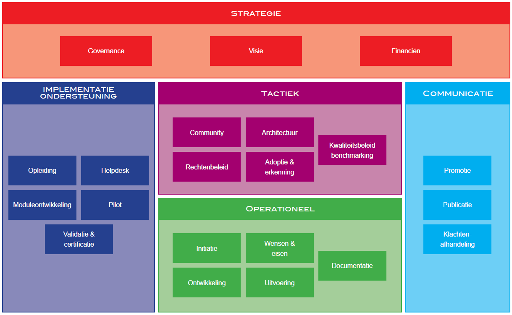

# Inleiding
Het beheer van de Digikoppeling-standaard omvat het geheel van
processen, besturing, organisatie, informatievoorziening en
hulpmiddelen die noodzakelijk zijn om gebaseerd op open standaarden
Digikoppeling als open standaard in stand te houden, te
onderhouden en door te ontwikkelen. Het beheer van Digikoppeling is
gebaseerd op de principes uit de BOMOS standaard.

## Leeswijzer
De Digikoppeling standaarden zijn beschreven in een set van documenten.
Deze set is als volgt opgebouwd:

<figure>
  <object data="https://logius-standaarden.github.io/publicatie/dk/actueel/media/DK_Specificatie_structuur.svg" type="image/svg+xml" id="infographic">Overzicht van de onderdelen van de Digikoppeling Standaard, de standaard is onderverdeeld in normatieve en ondersteunende onderdelen</object>
  <figcaption>Opbouw documentatie Digikoppeling</figcaption>
</figure>

<b>Legenda</b>

<table class="legendum">
    <thead>
        <tr>
            <th><strong>Kleur</strong></th>
            <th><strong>Soort Document</strong></th>
        </tr>
    </thead>
    <tbody>
        <tr>
            <td class="green">Groen</td>
            <td>Standaard documentatie</td>
        </tr>
        <tr>
            <td class="grey">Grijs</td>
            <td>Ondersteunende documentatie</td>
        </tr>
    </tbody>
</table>

<b>Beheer</b>

- De standaarddocumenten (groen/vierkant aangegeven) vallen onder het beheer zoals geformaliseerd in het document [[[?DK-Beheermodel]]].

- De ondersteunende documentatie wordt onderhouden door Logius als de beheerder van de standaard (en afgestemd met stakeholders/ gebruikers).

- Alle goedgekeurde documenten zijn te vinden op de website van Logius, [www.logius.nl](https://www.logius.nl/onze-dienstverlening/domeinen/gegevensuitwisseling/digikoppeling).

De Digikoppeling Koppelvlakstandaarden bevatten meerdere profielen
waarin een samenhangend interactiepatroon voor berichtuitwisseling is
beschreven2.

2: Een Digikoppeling service (Service Provider en Service
Requester) werkt altijd volgens een vooraf bepaald profiel voor
berichtenuitwisseling volgens een Koppelvlakstandaard.

"Gebruik en achtergrond Digikoppeling-certificaten" en de Best
Practice documenten zullen blijvend beheerd worden, maar volgens
afwijkende procedures. Deze documenten vereisen niet dezelfde strikte
besluitvorming aangezien zij een toelichting vormen bij de
Koppelvlakstandaarden en architectuur.

Het beheer heeft ook betrekking op de bij de Digikoppeling-familie
behorende documenten, bestanden en voorzieningen, zoals nieuws en
persberichten, factsheets, presentaties, opleidingsmateriaal,
relatiegegevens van Digikoppeling participanten. Het beheer hiervan
vraagt echter ook een minder formele besluitvormingsprocedure.

Bij de Digikoppeling horen de volgende ondersteunende hulpmiddelen en
ICT voorzieningen:

- Digikoppeling OIN Register en het hieraan gekoppelde CPA-register,

- Digikoppeling Compliance Voorzieningen (WUS, ebMS2, grote berichten),

Het beheer over deze voorzieningen is in bestaande beheerprocedures
van Logius ondergebracht.

### Bijlagen
Practische aspecten van het beheer, zoals de gebruikte applicaties
en webservices zijn opgenomen in bijlagen van dit document.
De bijlagen zijn niet specifiek voor Digikoppeling maar zijn relevant
voor alle standaarden onder beheer bij Logius.

## Digikoppeling
Digikoppeling vormt de logistieke laag voor standaardisatie van
communicatie tussen systemen bij overheidsorganisatie op basis van
webservice standaarden. Digikoppeling is daardoor een laag die zich
bevindt tussen het transportnetwerk (b.v. Diginetwerk of Internet)
en de applicatielaag (functionele berichtinhoud). De systemen die
Digikoppeling gebruiken zijn zowel systemen toegepast worden voor
interactie van burgers met overheden als voor systemen die berichtenverkeer
tussen overheden afhandelen. Be berichtenverkeer gaat het hierbij vooral
om berichten rondom de basisregistraties.

De Digikoppeling-standaard is binnen de overheid in gebruik bij
diverse organisaties, samenwerkingsverbanden en/of ketens.
Een groot aantal ICT leveranciers biedt ondersteuning aan de voor
Digikoppeling benodigde open standaarden (WUS, ebMS, HTTPS)
in hun producten en dienstverlening. De Digikoppeling standaard
heeft de zich afgelopen tijd ontwikkeld tot een volwassen standaard
die in een grote en brede community wordt ontwikkeld. Bij het
beheer van de Digikoppeling-standaard zijn veel verschillende
organisaties betrokken uit de gehele Digitale Overheid.
De voornaamste organisaties zijn ministeries, Manifestpartijen,
houders van basisregistraties en landelijke voorzieningen,
ketenpartijen, ICT leveranciers en gemeenten via de VNG.
Opdrachtgever voor Digikoppeling is het Ministerie van BZK.

### Nut
Doel van Digikoppeling is om door vergaande standaardisatie de
interoperabiliteit tussen overheden te bevorderen.
Als de 'envelop' van de 'berichten' is gestandaardiseerd kan
ieder voorzieningen  voor postverzending inrichten die
onafhankelijk zijn van de berichten in de 'envelop'.

De systemen die Digikoppeling gebruiken zijn zowel
frontoffice-systemen (die interactie met burgers en bedrijven
  afhandelen) als systemen van andere overheden en in het
bijzonder de basisregistraties (zie onderstaand figuur).

### Werking
De Digikoppeling Koppelvlakstandaarden bevatten meerdere profielen
waarin een samenhangend interactiepatroon voor berichtuitwisseling is
beschreven2.

2: Een Digikoppeling service (Service Provider en Service
Requester) werkt altijd volgens een vooraf bepaald profiel voor
berichtenuitwisseling volgens een Koppelvlakstandaard.

### Status
Digikoppeling is opgenomen op de _pas toe of leg_ uit lijst van het Forum 
Standaardisatie.

## BOMOS
Het activiteitendiagram toont welke lagen het model onderscheidt en welke activiteiten daarbinnen onderscheiden worden. De lagen en de ondersteunende
activiteiten worden elk in een hoofdstuk besproken.

Voor meer details of BOMOS verwijzen we naar de documentatie: [BOMOS, het fundament](https://gitdocumentatie.logius.nl/publicatie/bomos/fundament/) en [BOMOS, de verdieping](https://gitdocumentatie.logius.nl/publicatie/bomos/verdieping/)
