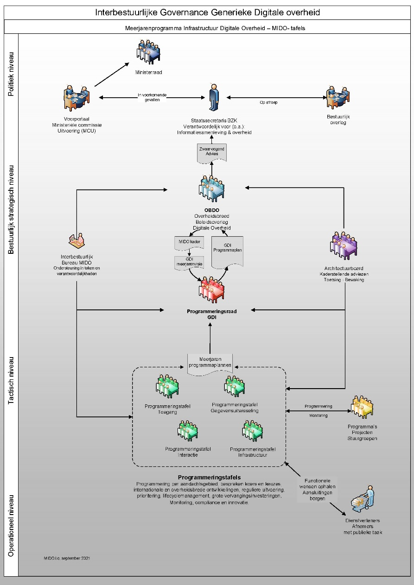

# Strategie

De strategische activiteiten van BOMOS bestaan uit de onderdelen
Visie, Govenance en Financiering. Deze onderdelen en hun toepassing op
het beheer van Digikoppeling worden hieronder beschreven.

## Visie

Met de Digikoppeling standaard wil de Nederlandse overheid
interoperabiliteit
bevorderen. Dit komt erop neer dat overheden dezelfde standaard in
vergelijkbare situaties toepassen. Dit maakt uiteindelijk dat
componenten en systemen onderling effectief gegevens uit kunnen
wisselen. Zowel horizontaal in één voorziening binnen één situatie als
verticaal tussen voorzieningen in verschillende situaties en tussen
organisaties. Deze doelstelling wordt onderschreven door een breed
scala aan partijen die deelnemen aan het xxx Kennisplatform, waar de
ontwikkeling van de standaard zijn oorsprong heeft, en is bestendigd
door Forum

Standaardisatie en het OverheidsBrede Beleidsoverhed Digitale Overheid
(OBDO), die xxxx standaard hebben opgenomen op de zogenaamde ‘pas toe
of leg uit’-lijst met andere standaarden die interoperabiliteit
bevorderen [zie ook de basisinformatie van het Forum Standaardisatie](https://www.forumstandaardisatie.nl/basisinformatie).

De toetsingsprocedure voor opname van een standaard op
_pas toe of leg uit_ lijst bestaat uit de volgende stappen:

1. Aanmelding
2. Intake
3. Expertonderzoek
4. Openbare consultatie
5. Advisering door het Forum Standaardisatie
6. Vaststelling door het Overheidsbreed Beleidsoverleg Digitale Overheid

Deze criteria staan op: [Toetsingsprocedure en criteria voor lijsten met open standaarden (forumstandaardisatie.nl)](https://www.forumstandaardisatie.nl/sites/default/files/BFS/3-lijsten/standaarden-aanmelden/toetsen/Toetsingsprocedure-en-criteria-22_0.pdf)

De afdeling Standaarden van Logius werkt samen met het Forum
Standaardisatie aan de promotie van open standaarden via
kennisplatforms, bijeenkomsten en seminars. De standaarden die Logius
beheert, zijn verplichte standaarden voor overheidsorganisaties en
staan op de 'Pas toe of leg uit'-lijst van het Forum of zijn verplicht
via wetgeving.

## Governance

### Governancestructuur

Bij het beheer van een open standaard hoort een open governance en een
open procedure voor belanghebbenden om te kunnen participeren in het
beheer. Logius neemt hierin de rol van onafhankelijke, duurzame
beheerpartij en facilitator. Logius gaat uit van de governance van de
Generieke Digitale Infrastructuur (GDI). De GDI geeft richting aan het Meerjarenprogramma Infrastructuur Digitale Overheid (MIDO). Voor MIDO
is een governance opgesteld waarin de stakeholders van Logius richting
geven aan de ontwikkelingen bij Logius. Standaardenbeheer sluit aan op
deze governance.

Bij het beheer van Digikoppeling worden verschillende gremia onderscheiden die gezamenlijk invulling geven aan de governance op de standaard:

1.  De Digikoppeling community

Dit is het meest operationele gremium waarin iedere
belangstellende/belanghebbende vragen kan stellen over de
Digikoppeling standaard en suggesties kan doen voor de
doorontwikkeling van de standaard.

Het beheer van de Digikoppeling standaard is open. Dat wil zeggen dat
alle documentatie van de standaard en de wijzigingen open beschikbaar is.
Wijzigingsvoorstellen kunnen door iedereen ingediend worden.
Voor contact met de Community maakt Logius gebruik van de Logius website en van [Github](#bijlage-gebruik-github-in-het-beheerproces).

2.  Technisch Overleg

Het Technisch Overleg (TO) is een periodieke bijeenkomst  waarbij de
vragen en doorontwikkelwensen m.b.t. Digikoppeling worden doorgenomen,
geprioriteerd en worden uitgewerkt. Daarnaast wordt door de leden de
releaseplanning en de roadmap opgesteld. Deelname aan het Technisch Overleg
is vrij voor eenieder die een belang heeft bij de standaard
(overheid, wetenschap en markt).

[De agenda en stukken van het Technisch overleg zijn openbaar.](https://github.com/Logius-standaarden/Overleg/tree/main/Digikoppeling)

3.  Tactisch overleg

Dit gremium is verantwoordelijk voor het vaststellen van de
doorontwikkel-roadmap, het vaststellen van minor releases van de
standaard en dient als het voorportaal van het
strategisch/besluitvormende gremium: het OBDO.

Binnen de MIDO structuur heeft de programmeringstafel Gegevensuitwisseling
de rol van tactisch overleg.
[Voor de programmeringstafel maakt Logius een deelagenda over standaarden](https://github.com/Logius-standaarden/Overleg/tree/main/Programmeringstafels/Gegevensuitwisseling)
die deel uitmaakt van de agenda van het overleg.

4.  Het Overheidsbrede Beleidsoverleg Digitale Overheid (OBDO)

Dit is het hoogst ambtelijke gremium dat besluit over major releases
van de standaard, het beheermodel van de standaard en externe
publicaties over releases en van het standaardenbeleid. Op dit moment
wordt het OBDO louter ‘gevoed’ door Forum Standaardisatie en is de
focus voornamelijk het bestendigen van major releases van de
standaard. Op het moment dat het tactische gremium is ingevuld, zal
het OBDO waarschijnlijk een breder scala aan onderwerpen langs krijgen
ter bestendiging.

De MIDO structuur kan ook de mogelijkheid bieden om de
Programmeringsraad GDI te laten besluiten over de standaarden.
Wijzigingen worden dan ter informatie aan het OBDO voorgelegd.

Het strategisch overleg neemt besluiten op basis van adviezen van de
tactisch en strategische overleggen en het advies van de
beheerorganisatie. Daarnaast kan het strategisch overleg een
richtinggevend besluit nemen wat aan de beheerorganisatie voorgelegd
wordt. Bijvoorbeeld een ingrijpende wijziging zoals het overgaan naar
een nieuwe (onderliggende) standaard kan in het strategisch overleg
besloten worden.

In tabelvorm:

| **Gremium**  | **Accent**   | **Rol participant**  | **Ondersteuning door beheerder (Logius)** |
|     ---      |    ----      |         ---          |                   ---                     |
| **Community** (omvang beperkt) | Inhoud -- delen    | Samen met alle leden van de Interesse Groep (IG): 1. Volgen van ontwikkelingen. 2. Leveren van input voor de doorontwikkeling van de standaard. |  1. Informatie m.b.t. specificaties en beheer open delen met community. 2. Deelnemen aan stuurgroep en werkgroepen |
| Technisch Overleg (Operationeel, 4x per jaar) | Inhoud - afstemmen | Samen met andere experts van de Technische Architectuur Groep (TAG):  1. Inhoudelijk ontwikkelen van standaard onderdelen en bijbehorende documentatie.  2. Voorbereiden van de release- planning. 3. Prioriteiten stellen voor de ontwikkeling, roadmap van nieuwe releases van de standaarden. 4. Goedkeuring van aanpassingen op de standaard. | 1. Analyseren, ontwerpen en uitwerken van specificaties.  2. Volgen en beïnvloeden van aanpalende standaarden.  3. Organiseren bijeenkomsten.  4. Opstellen en verspreiden notulen. 5. Beschikbaar stellen specificaties. |
| Tactisch/Strategisch (4x per jaar) | Prioritering proces en uitwerken strategisch advies | Samen met andere participanten:  1. Vaststellen roadmap van de standaard.  2. Voorportaal OBDO 3. Vaststellen minor releases van de standaard. | 1. Analyseren, ontwerpen en uitwerken van beleidszaken, (release)planning. |
| OBDO (Strategisch besluitvormend, 2x per jaar) | Bestuurlijk besluit | Samen met andere bestuurders:  1. Vaststellen major releases van de standaard.  2. Vaststellen beheermodel van de standaard.  3. Vaststellen externe publicaties over het standaardenbeleid en releases. |  1. Begeleiding van de Adviesraad en inbreng via secretariaat OBDO.  2. Publiceren standaarden en andere Standaard-informatie |

### Besluitvorming

In alle overleggremia vindt besluitvorming plaats op basis van
consensus. Mocht consensus niet mogelijk zijn, dan gaat het vraagstuk
met een weergave van de verschillende standpunten door naar het
eerstvolgend-hoger gelegen-gremium. Indien in het hoogste gremium (het
OBDO) geen consensus bereikt kan worden, heeft de voorzitter van het
OBDO (ministerie van BZK) de beslissende stem.

### Deelname

Uitbreidingen en aanpassingen in de xxx standaard komen tot stand door
participatie van de verschillende belanghebbenden. Belanghebbenden
kunnen op vier manieren participeren aan het wijzigings- en
besluitvormingsproces:

1.  Als lid van de xxx Community van het Kennisplatform / de Interesse Groep (IG)
2.  Als lid van de Technische Architectuur Groep (TAG)
3.  Als lid van het Tactisch overleg
4.  Als lid van het MIDO of OBDO

1.  Leden van het technisch overleg dienen een aantoonbaar belang te hebben bij de standaard.
2.  De omvang en samenstelling moet een goede vertegenwoordiging bevatten van de verschillende belangen rond de standaard. We gaan uit van 1 deelnemer per organisatie.
3.  Het belang van de Nederlandse overheid dient voldoende geborgd te zijn in het technisch overleg.

Personen/partijen die willen deelnemen aan het technisch overleg
kunnen een mail sturen aan Logius waarin zij aangeven wat hun belang is
bij de standaard. Met inachtneming van bovenstaande punten, beoordeeld
Logius de aanvraag.

## Financiering

Het beheer van de xxx standaard wordt gefinancierd door min. BZK voor
een initiële periode van tenminste drie jaar (2020-2023) om gebruikers
het vertrouwen te geven dat er geen desinvesteringen worden gedaan bij
het implementeren van de standaard. Na drie jaar wordt de financiering
verlengd als blijkt dat het nut van en de behoefte aan de standaard
nog aanwezig is.
