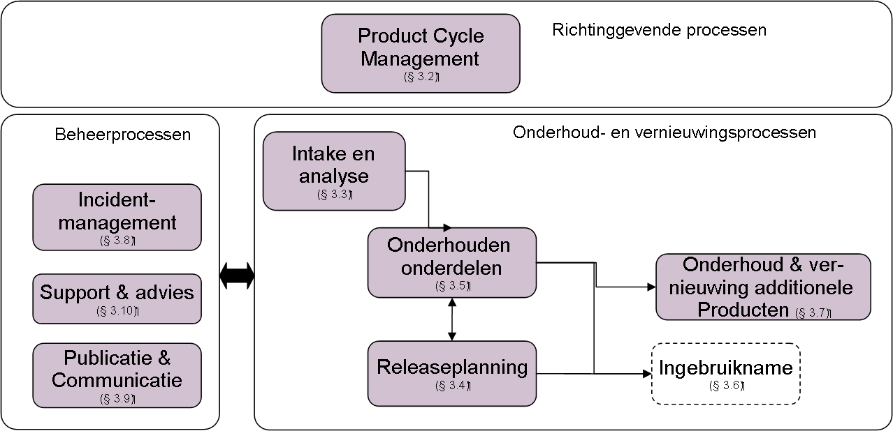
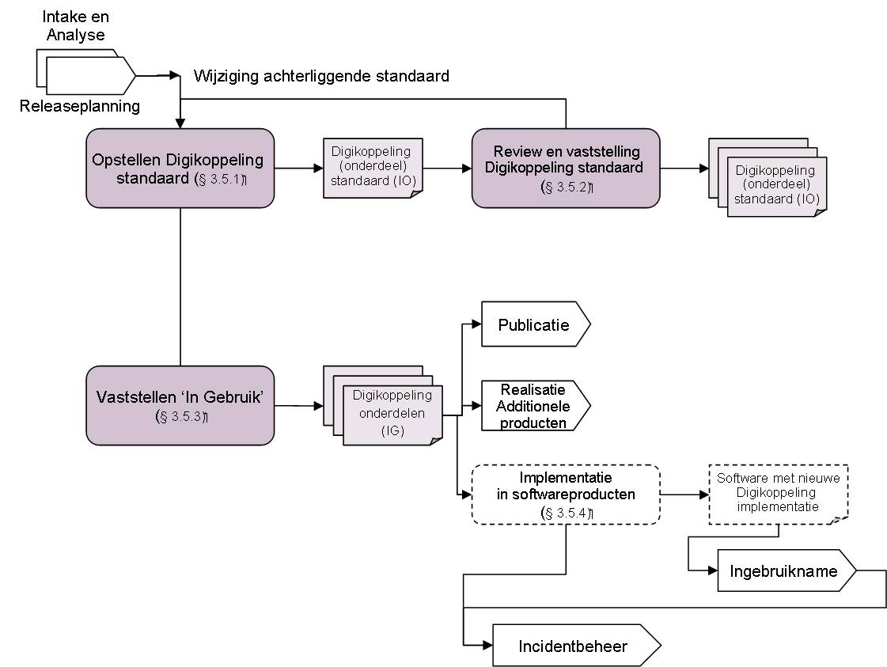

# Bijlage A: Beheer- en onderhoudsprocessen

## Procesoverview

De hoofdprocessen voor het beheer en onderhoud van de Digikoppeling standaard zijn in onderstaande figuur schematisch aangegeven. De hoofdprocessen zijn in de volgende paragrafen nader uitwerkt.

*Noot: gestippelde processen vallen buiten het beheermodel.*

## Proces: Digikoppeling Product Cycle Management

Digikoppeling kent net als veel andere producten een strategisch proces van Product Cycle Management. Het doel van dit strategische proces is dat de Digikoppeling standaard zowel inhoudelijk als organisatorisch goed aansluit bij de behoefte van de verschillende belanghebbenden.

Jaarlijks wordt een verbeterplan voor de Digikoppeling standaard opgesteld door de beheerder ervan. Op grond van een omgevingsanalyse worden daarvoor nieuwe kansen en mogelijkheden voor het beheerde deel van de Digikoppeling standaard in kaart gebracht. Daarnaast worden de interne verbeterpunten voor de beheerorganisatie en participatievormen in kaart gebracht. De kansen samen met de interne verbeterpunten worden vertaald in een “Digikoppeling jaarplan”.

In dit verbeterplan komen de volgende onderwerpen aan de orde:

- Een geactualiseerd productbeleid, –strategie en –portfolio;

- Aanpassingen aan proces, besluitvorming, participatie en informatievoorziening i.c het beheermodel;

- Organisatorische aanpassingen bij de beheerder of het elders beleggen van het beheer;

- Eventuele behoefte aan en ontwikkeling van nieuwe additionele producten;

- Benodigde middelen (geld, mensen);

- Prioriteren van ontwikkelopdrachten: op welke wijze wordt de beschikbare capaciteit zo efficiënt en effectief mogelijk ingezet.

Het jaarplan voor Digikoppeling maakt deel uit van de jaarplan-cyclus van Logius en wordt gepresenteerd aan eigenaar (beheer en exploitatie) en Klantenraad(doorontwikkeling). Vervolgens wordt het ter goedkeuring aangeboden aan de opdrachtgever van de Digikoppeling beheerder, die de financiële middelen verstrekt voor het uitvoeren van het verbeterplan en de beheeractiviteiten. Momenteel is het Ministerie van BZK de opdrachtgever van de beheerder.

## Proces: Intake en Analyse

### Intake wijzigingsaanvraag

Een Wijzigingsaanvraag voor een Digikoppeling onderdeel kan ontstaan uit een breed scala van ontwikkelingen of problemen. Ontwikkelingen die van invloed zijn, zijn bijvoorbeeld: ontwikkelingen in de standaardisatie wereld, nieuw beleid, veranderingen in samenwerking of processen, vernieuwing van dienstverlening, veranderingen in basisregistraties of in infrastructuur en ontwikkeling van technologie. Verder zijn problemen uit de praktijk of het hebben van een goed idee aanleiding voor een wijzigingsaanvraag. De aanvraag wordt via mail naar Servicecentrum@logius.nl, telefonisch of direct via contact met een Digikoppeling deskundige van Logius ingediend. Bij voorkeur vult degene van de betrokken partij die het idee, het probleem of aanvraag doet zelf het formulier “Wijzigingsaanvraag” in.

De ideeën of problemen kunnen van verschillende partijen op diverse manieren binnenkomen:

- Gebruikers van Digikoppeling onderdelen,

- Beheerders van Basisregistraties;

- Overleggroepen, tijdens de bijeenkomsten van de overleg- en werkgroepen,

- Projectgroepen met Digikoppeling-gerelateerde dossiers (bijv. Digikoppeling, Stelselorganisatie, NORA, enz.),

- Leden van de Digikoppeling-Community via het Digikoppeling-forum op de website van de Digikoppeling;

- Geregistreerde problemen en fouten vanuit het incident management proces.

Het probleem, de behoefte of het idee wordt beschreven in een Wijzigingsaanvraag. De beheerder registreert deze wijzigingsaanvraag. Elke wijzigingsaanvraag wordt voorzien van een Aanvraagnummer en bijgehouden in een overzicht (b.v. spreadsheet). Deze wordt bewaard in een wijzigingsaanvraag administratie.

Alleen Wijzigingsaanvragen die betrekking hebben op aanpassingen ten opzichte van de meest recente release van een Digikoppeling onderdeel met de status “In Gebruik” worden in behandeling genomen.

### Beoordelen wijzigingsaanvraag

Een Digikoppeling deskundige van de Digikoppeling beheerder doet een eerste beoordeling of de aanvraag voldoende helder en uitgewerkt is voor verdere behandeling. Zonodig verzamelt hij aanvullende informatie. Hij bepaalt of de betreffende wijzigingsaanvraag in een bijeenkomst van het Digikoppeling Technisch Overleg beoordeeld kan gaan worden. Als een wijzigingaanvraag niet verder in behandeling wordt genomen zal de deskundige dit aan de aanvrager kenbaar maken.

Het Digikoppeling Technisch Overleg beoordeelt vervolgens ook de wijzigingsaanvraag. Digikoppeling Technisch Overleg beslist of de wijzigingsaanvraag uitgewerkt en geanalyseerd moet gaan worden. Daarvoor neemt het Digikoppeling Technisch Overleg per wijzigingsaanvraag een besluit over:

- Het wel of niet analyseren en uitwerken van de wijzigingsaanvraag in een Wijzigingsverzoek (RFC),

- Het wel of niet opstellen van een impactanalyse. Er wordt geen impactanalyse gemaakt als het gaat om het oplossen van fouten of kleine wijzigingen aan een Digikoppeling onderdeel;

- Terugverwijzen, Afwijzen of Uitstellen. Als een wijzigingaanvraag niet verder of later in behandeling kan worden genomen zal dit door de beheerder namens het Digikoppeling Technisch Overleg aan de aanvrager kenbaar worden gemaakt.

### Uitwerken en analyse wijzigingsaanvraag tot RFC

Een Digikoppeling deskundige analyseert en werkt de wijzigingsaanvraag uit tot een wijzigingsverzoek (RFC). Dit kan een Digikoppeling deskundige zijn van de Digikoppeling beheerder, van een ICT-leverancier, een gemeente of een andere belanghebbende partij. Het resultaat van dit proces is het wijzigingsverzoek.

De Digikoppeling deskundige stuurt het wijzigingsverzoek aan alle leden van het Digikoppeling Technisch Overleg. Het wijzigingsverzoek wordt behandeld in een bijeenkomst van het Digikoppeling Technisch Overleg. De Digikoppeling deskundige die de analyse en uitwerking heeft uitgevoerd, licht de voorgestelde aanpassingen toe. het Digikoppeling Technisch Overleg is eindverantwoordelijk voor de inhoudelijke kwaliteit van het wijzigingsverzoek.

Na behandeling neemt het Digikoppeling Technisch Overleg een besluit over de “status” van het wijzigingsverzoek:

| **Status** |  **Status van een wijzigingsverzoek** | **Omschrijving**                                                                                                             |
|------------|---------------------------------------|------------------------------------------------------------------------------------------------------------------------------|
| N          | Niet uitgewerkt                       | De beginstatus van een wijzigingsverzoek                                                                                     |
| T          | Toestemming voor verdere uitwerking   | het Digikoppeling Technisch Overleg geeft een Digikoppeling deskundige toestemming het RFC uit te werken                     |
| U          | Uitgewerkt                            | Het RFC is door een Digikoppeling deskundige uitgewerkt en is gereed voor behandeling in het Digikoppeling Technisch Overleg |
| O          | Aanpassen en opnieuw behandelen       | Na behandeling in het Digikoppeling Technisch Overleg wordt het RFC aangepast om vervolgens opnieuw te worden behandeld      |
| V          | Voorwaardelijke goedkeuring           | Het RFC is door het Digikoppeling Technisch Overleg onder voorbehoud goedgekeurd                                             |
| G          | Goedgekeurd                           | Het RFC is door het Digikoppeling Technisch Overleg goedgekeurd                                                              |
| A          | Afgewezen                             | Het RFC zal niet (langer) door het Digikoppeling Technisch Overleg in behandeling genomen worden                             |

De status van elk wijzigingsverzoek wordt bijgehouden in een statusoverzicht. In bijlage E is een voorbeeld opgenomen. Het statusoverzicht maakt deel uit van de wijzigingenadministratie.

### Proces: Administratie en ondersteuning

Dit proces is een ondersteunend proces van het beheer en onderhoud van Digikoppeling. Het bestaat uit:

- Het registreren, bijhouden en het bewaken van de wijzigingsaanvragen;

- Het bijhouden van het statusoverzicht met de wijzigingsverzoeken (zie voorbeeld in bijlage E);

- Het vastleggen en op orde houden van de interne informatievoorziening voor Digikoppeling die bestaat uit:

  - Beheerdocumentatie zoals beheermodel, sjablonen, e.d;

  - Organiseren van bijeenkomsten voor Digikoppeling Technisch Overleg en voorbereiden van Digikoppeling-onderwerpen voor de Klantenraadenhet OBDO;

  - Plannen, (inzet)contracten en overeenkomsten;

  - Afspraken met diverse partijen;

  - Bijhouden van namen, emailadressen, telefoonnummers van de deelnemers van de Digikoppeling Technisch Overleg en leden community, externe deskundigen, en dergelijke;

  - Verslagen van de diverse groepen rond Digikoppeling;

  - Presentaties en documenten over Digikoppeling.

## Proces: Releaseplanning

De onderdelen van de Digikoppeling standaard en Digikoppeling voorzieningen zullen gezamenlijk en afzonderlijk onderhevig zijn aan beheer en onderhoud wat leidt tot nieuwe releases. Het vaststellen van nieuwe releases vindt plaats binnen het releaseplanningsproces. De Klantenraad gegevensuitwisselingis verantwoordelijk voor de juiste uitvoering. In de Klantenraad komen alle belanghebbenden met verantwoordelijkheid voor de behoefte, effecten en impact op de bedrijfsvoering, informatievoorziening en ICT samen.

Het vaststellen van een nieuwe release van afzonderlijke Digikoppeling onderdelen en een samenhangende Digikoppeling architectuur wordt gedaan volgens het beleid in paragraaf 2.4. De Klantenraadzal binnen de releaseplanning niet alleen nieuwe releases voordragen aan het OBDOmaar ook voorstellen hoe lang oude releases in bedrijf blijven en ondersteund zullen worden.

### Opstellen Releasevoorstellen

Circa een half jaar voor de beoogde releasedatum stelt de beheerder per release verschillende voorstellen op.

Voor het opstellen van releasevoorstellen worden naast de ingediende wijzigingsverzoeken, omgevingsontwikkelingen, ontwikkeling achterliggende standaarden, het releasebeleid de volgende releasetermijnen gehanteerd:

| Digikoppeling onderdeel                                                       | Releasefrequentie          |
|-------------------------------------------------------------------------------|----------------------------|
| Digikoppeling architectuur Identificatie & Authenticatie                      | maximaal 1x per twee jaar. |
| Digikoppeling Koppelvlak standaarden                                          | maximaal 1x per jaar       |
| Gebruik & Achtergrond Digikoppeling Certificaten Digikoppeling Best Practices | Maximaal 2 x per jaar      |

Afwijkende releasetermijnen van Digikoppeling zijn toegestaan in de volgende situaties:

- vanwege invoering van nieuwe wet- en regelgeving;

- vanwege het oplossen van fouten in de standaard die de continuïteit van de bedrijfsvoering in gevaar brengen;

- bij nieuwe Digikoppeling koppelvlakstandaarden die nog niet in software zijn geïmplementeerd en nog niet in bedrijf zijn;

- indien 2/3 meerderheid van de Klantenraad het eens is over de noodzaak.

Elk releasevoorstel bestaat uit dezelfde onderwerpen als een releaseplan, dit zijn:

- vaststelling van de nieuwe verzameling van samenhangende releases van de Digikoppeling-onderdelen (de samenhang zal veelal in de release-nummering tot uitdrukking komen);

- een overzicht van de wijzigingsverzoeken die wel en niet meegenomen worden in het aan te passen Digikoppeling onderdeel;

- een keuze op welke releases van onderliggende standaarden (WUS, ebMS, http, e.d.) wordt aangesloten;

- de verwachte tijdsplanning voor de publicatie van de Digikoppeling onderdelen;

- een advies over de periode van uitfasering van de oude Digikoppeling release.

De releasevoorstellen worden gepubliceerd op het Digikoppeling forum.

### Vaststellen releaseplan eerstvolgende Digikoppeling release

Het releaseplan van Digikoppeling zal worden vastgesteld in een bijeenkomst van deKlantenraad. De belanghebbenden krijgen de gelegenheid om de eigen voorkeur toe te lichten.

Bij het vaststellen van de inhoud van een nieuwe release van een Digikoppeling onderdeel wordt gestreefd naar consensus en acceptatie binnen de Klantenraad. Indien besluitvorming over de nieuwe release uitblijft zal de beheerder van de standaard samen met het Ministerie van BZK een releaseplan vaststellen.

Het releaseplan van Digikoppeling bestaat uit dezelfde onderdelen als het release-voorstel (zie paragraaf 3.4.1).

Het releaseplan wordt gebruikt voor de realisatie van de Digikoppeling onderdelen, het doorvoeren van de wijzigingsverzoeken in de desbetreffende Digikoppeling koppelvlakstandaarden en technische documentatie.

Het vastgestelde releaseplan wordt gepubliceerd en wordt verwerkt in de Digikoppeling roadmap, waarin de afhankelijkheden tussen releases zichtbaar zijn gemaakt.

## Proces: Onderhouden Digikoppeling onderdelen

Het proces Onderhouden Digikoppeling onderdelen bestaat uit het doorvoeren van de wijzigingen in de Digikoppeling (deel)specificatie(s). Het gaat zowel om de aanpassingen aan de Digikoppeling Architectuur als om aanpassingen aan de Koppelvlak standaarden. De belangrijkste input voor dit proces bestaat uit het definitieve releaseplan, de wijzigingsverzoeken en specificaties van onderliggende standaarden gebruik gemaakt moet worden.

### Opstellen Digikoppeling standaard

Een Digikoppeling deskundige verzamelt en verwerkt alle uitgewerkte wijzigingsverzoeken (RFC’s), die deel uitmaken van het vastgestelde releaseplan, tot een complete en nieuwe Digikoppeling standaard. Het geheel bestaat uit:

- verzamelde wijzigingsverzoeken,

- toelichting bij verwerking van wijzingsverzoeken in nieuwe standaard,

- Inhoudelijke uitwerking van nieuwe Architectuur-, Koppelvlakstandaard- en/of Best-practice document,

- documentatie met wijzigingshistorie.

Het resultaat wordt ter review aangeboden aan de leden van het Digikoppeling Technisch Overleg.

### Review en openbare consultatie Digikoppeling standaard

Nadat een (deel) standaard is opgesteld door een Digikoppeling deskundige volgt de beoordeling ervan door het Digikoppeling Technisch Overleg. In een bijeenkomst van het Digikoppeling Technisch Overleg wordt de Digikoppeling standaard doorgenomen en het eventuele commentaar besproken en afspraken gemaakt over de verwerking ervan. Zonodig vindt een extra iteratie plaats van opstellen en reviewen. Als het Digikoppeling Technisch Overleg de deelspecificatie goedkeurt bestaat het resultaat uit een vastgestelde (deel)specificatie voor een Digikoppeling onderdeel.

Nadat het Digikoppeling Technisch Overleg heeft aangegeven dat een nieuwe release van een Digikoppeling onderdeel gereed is voor ingebruikname, zal een openbare consultatie plaatsvinden van de wijziging. De resultaten van deze openbare consultatie worden door de beheerder verzameld en aangeboden voor besluitvorming.

### Vaststellen ‘In Gebruik’

Na de openbare consultatie, zal aan de leden van de Klantenraad gevraagd worden om een besluit over toekenning van de status “In gebruik” aan deze nieuwe release van het Digikoppeling onderdeel te nemen. In dit besluit weegt de Klantenraadde resultaten uit de openbare consultatie. Dit besluit wordt in een Klantenraadbijeenkomst genomen waarbij aan de volgende criteria voldaan moet worden:

- De bijeenkomst van de Klantenraad waar dit besluit wordt genomen is tenminste één maand van te voren aangekondigd;

- De nieuwe release van het Digikoppeling onderdeel is tenminste 10 werkdagen voor de Klantenraadbijeenkomst beschikbaar op het Digikoppeling forum;

- Een meerderheid van de aanwezigen geeft aan dat de nieuwe release van het Digikoppeling onderdeel aan hun eisen en wensen voldoet en geschikt is om door hen toegepast te worden;

Indien aan bovenstaande criteria is voldaan dan zal de Digikoppeling beheerder namens de Klantenraadde nieuwe release van het Digikoppeling onderdeel als “In Gebruik” publiceren en dit openbaar maken middels een persbericht.

### Implementatie in softwareproducten

Nadat een Digikoppeling onderdeel de status “In Gebruik” heeft gekregen kunnen gebruikersorganisaties het betreffende Digikoppeling onderdeel in hun softwareproducten implementeren en toepassen.

De aanvang en de tijdsduur van het implementeren in software kan sterk variëren. Afhankelijk van de wijziging kan deze zich beperken tot een (kleine) herconfiguratie van adapter-software tot aanpassing van bestaande informatiesystemen die Digikoppeling toepassen. De website van Logius en de Digikoppeling community bieden handige handvatten en ook Logius biedt implementatie-ondersteuning.

Het feitelijk implementeren van Digikoppeling of een nieuwe release of onderdeel ervan in softwareproducten valt grotendeels buiten het beheermodel.

## Proces: Ingebruikname

Het zwaartepunt van de uitvoering van het proces Ingebruikname ligt bij de gebruikers van een Digikoppeling onderdeel en bij de leveranciers van software. Enerzijds betreft de ingebruikname het voorschrijven van een bepaalde release van een Digikoppeling onderdeel en anderzijds het proces van het in bedrijf nemen van adapters en informatiesystemen met Digikoppeling koppelingen.

Voorschrijven en planning

Voor gebruik van Digikoppeling binnen de eigen informatievoorziening zal een gebruiker bij de keuze van een release van een Digikoppeling onderdeel rekening houden met de eigen ambitie, doelstellingen, ICT strategie, ketenafspraken, roadmap, de beschikbaarheid van software en de status van de benodigde Digikoppeling onderdelen.

Gebruikers die zelf de regie voeren over de eigen applicatieportfolio wordt geadviseerd de meeste recent vastgestelde Digikoppeling release voor te schrijven voor nieuwe software en bij vervanging of upgrading van bestaande koppelingen mee te nemen in de onderhoudsplanning.

Gebruikers zullen in hun programma‟s van eisen opnemen dat applicaties die gericht zijn op integratie (zoals middleware, brokers, servicebus en distributiesystemen) van alle relevante Digikoppeling configuraties ten minste twee opeenvolgende releases gelijktijdig ondersteunen.

In bedrijf nemen

Dit deel betreft de softwaredistributie, de integratie- en acceptatietesten en het in bedrijf stellen van software waar Digikoppeling koppelingen zijn ingebouwd.

Het preventief testen en keuren van de Digikoppeling koppelingen in aangepaste software of nieuwe software maakt deel uit van dit proces. De Digikoppeling Compliance voorzieningen zullen hierbij toegepast worden. Dit proces speelt zich voornamelijk af buiten het beheer van de Digikoppeling standaard. Het is daarom niet nader uitgewerkt.

## Proces: Vernieuwing en onderhoud additionele producten

Nadat de nieuwe Digikoppeling-standaarden zijn vastgesteld, past de beheerder de additionele Digikoppeling producten aan. Het gaat om Compliance Voorzieningen OIN Register, CPA register. Ook gaat het om website, opleidingsdocumenten, documenten ter ondersteuning van implementatie en andere algemene documentatie.

## Proces: Incidentbeheer

Indien een Digikoppeling onderdeel de status “In Gebruik” heeft, worden problemen en fouten die geconstateerd worden bij de implementatie in software of tijdens het gebruik in de praktijk aangemeld, geregistreerd en afgehandeld in het incident management proces. Dit geldt uitsluitend indien deze veroorzaakt worden door fouten in de Digikoppeling standaard zelf. Problemen veroorzaakt door afwijkingen op en/of onjuist gebruik van de Digikoppeling standaard worden niet in behandeling genomen. Een integratiedeskundige met Digikoppeling expertise kan verstoringen of fouten aanmelden. Afhankelijk van de urgentie en de noodzaak wordt ofwel de fout opgelost in het reguliere onderhoudsproces van Digikoppeling dan wel in een versnelde procedure. In het laatste geval wordt in overleg tussen degene die het incident heeft aangemeld en een Digikoppeling deskundige van de Digikoppeling beheerder een „patch‟ gemaakt. Het probleem of de fout samen met de patch of „work around‟ worden gepubliceerd opde Logius website9.. Naderhand worden de verschillende problemen en fouten meegenomen in een nieuwe release van Digikoppeling voor een structurele oplossing. De structurele afhandeling vindt plaats binnen de reguliere hoofdprocessen Onderhoud en vernieuwing.

9: Zie https://logius.nl/diensten/digikoppeling

## Proces: Publicatie en Communicatie

Als een Digikoppeling onderdeel de status „In Gebruik‟ heeft, worden verschillende zaken gepubliceerd. De Digikoppeling beheerder publiceert de volledige specificatie („In Gebruik‟) van een Digikoppeling onderdeel en een kort bericht op het publieke deel van zijn website. Publicatie houdt in dat de nieuwe release van een Digikoppeling onderdeel openbaar wordt gemaakt voor inbouw in software, brede uitrol en ingebruikname.

Verder wordt een persbericht uitgegeven, waarin de publicatie van de nieuwe release van het Digikoppeling onderdeel wordt aangekondigd. Ook wordt er door de beheerder een bericht in relevante nieuwsbrieven geplaatst.

Naast de nieuwe release van de standaard en nieuws- en persberichten worden ook additionele producten gepubliceerd na aangepast ze zijn. Factsheets, opleidingsmateriaal, presentaties, maar ook releasebeleid en Roadmap zullen worden gepubliceerd.

## Proces: Support

Het proces Support bestaat uit het afhandelen van vragen over Digikoppeling. In principe worden vragen ingediend via het Digikoppeling forum. Ook kunnen gebruikers van Digikoppeling (bijvoorbeeld overheidsorganisaties en softwareleveranciers) supportvragen indienen via Servicecentrum@logius.nl.

De vragen worden beantwoord door een Digikoppeling deskundige van de verantwoordelijke beheerder.

Voor de communicatie met basisregistraties zijn de betreffende beheerorganisaties aldaar het aanspreekpunt.

## Proces: Klachten

Klachten over de opzet of de uitvoering van het beheerproces dienen ingediend te worden bij de beheerder. Klachten dienen niet gericht te zijn op personen en niet beledigend of anderszins fatsoensnormen te overschrijden. De beheerder maakt klachten openbaar, inclusief organisatie en functie van de indiener.

De indiener van de klacht krijgt zo spoedig mogelijk en altijd terugkoppeling over de voortgang van en beslissing over zijn klacht.

