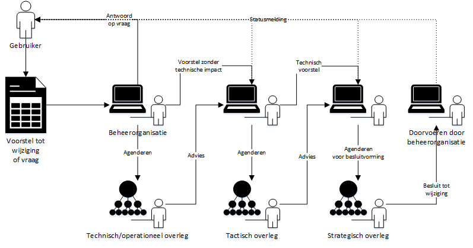

# Operationeel

Het operationele wijzigingsproces is ingericht op Github. De omgeving
die we ook gebruiken voor het beheer en de publicatie van de documentatie.
In dit hoofdstuk wordt het operationele wijzigingsproces op hoofdlijnen
beschreven. Voor details van de implementatie verwijzen we naar de
[bijlage over gebruik Github in het beheerproces](#Bijlage-Gebruik-Github-in-het-beheerproces)

## Initiatie

Toevoegingen aan de standaard zoals het toevoegen van een nieuwe
koppelvlakspecificatie worden behandeld als in introductie van een nieuwe
standaard. Een voorbeeld is de toevoeging van de REST API koppelvkakspecificatie
aan Digikoppeling.

1.  Uitbreidingen en aanpassingen in de Digikoppeling standaarden komen tot stand
    door participatie van de verschillende belanghebbenden.

2.  Belanghebbenden kunnen op verschillende manieren participeren.
    1. op persoonlijke titel (het proces is volledig open)
    2. als lid van de Digikoppeling Community
    3. als lid van één van de Digikoppeling overleggen: het Techisch Overleg,
       de Programmeringstafel Gegevensuitwisseling of het OBDO.

## Wensen en Eisen

Wensen en eisen zijn aanpassingen op de bestaande standaarden en
koppelvlakspecificaties.

> RFC's kunnen binnen komen via verschillende kanalen:

1.  Rechtstreeks bij de beheerorganisatie, tijdens overleggen, via de website of mail

2.  Bij de werkgroepoverleggen van de standaard en tijdens overleggen, via de
    website of mail

<aside class="example">
RFC's worden als issue's geregistreerd in de repository van het
kennisplatform/community op Github: voorbeeld:
<https://github.com/Geonovum/KP-APIs/issues>

Om te voorkomen dat er verschillende lijsten met issues en verzoeken
ontstaan, is met het kennisplatform/community afgesproken dat ieder
issue en verzoek als eerste wordt beoordeeld door de werkgroep van xxx
standaard. Dit voorkomt het ontstaan van verschillende stromen met
RFC's en geeft de werkgroep de gelegenheid om in te schatten of de RFC
betrekking heeft op de xxx standaard die Logius beheert, of dat er
sprake is van een verzoek dat het best kan landen in één van de (niet
normatieve) extensies die het kennisplatform/community beheert.

Dit houdt concreet in dat RFC's die rechtstreeks bij Logius worden
neergelegd, door Logius worden doorgespeeld aan de werkgroep van de
xxx standaard zodat daar de eerste beoordeling kan plaatsvinden.

*Figuur 3 ADR RFC Procesmodel*
</aside>

## Uitvoering en ontwikkeling (Wijzigingsproces)

_beschrijving proces_

1. Acceptatie van een wijzigingsvoorstel.
2. Labelen van een voorstel als groot/klein, aangeven van status.
3. Behandeling van een wijzigingsvoorstel.
4. Agendering voor een overleg.
5. Advisering vanuit overleggen.
6. Acceptatie van een wijzigingsvoorstel.
7. Doorvoeren van een wijzigingsvoorstel.

## Status van de standaard

> Logius, afdeling standaarden onderscheid vier statussen die de xxx
> standaard kan hebben:

| **Afkorting** | **Status van de standaard** | **Beschrijving van de status** |
|      ---      |              ---            |               ---              |
| IO | In Ontwikkeling | Een nieuwe release van de standaard is "In Ontwikkeling" wanneer er met medeweten en medewerking van participanten aan gewerkt wordt en wanneer dit onderdeel of deze release nog niet voor de buitenwereld is gepubliceerd. |
| IG | In Gebruik      | Als een nieuwe release van de standaard gereed is, en is bestendigd door Forum Standaardisatie, stelt het Technisch Overleg de status 'In Gebruik' vast. Door deze vaststelling worden gebruikers en ICT-leveranciers opgeroepen deze nieuwe release op te nemen in software en in gebruik te nemen. |
| EO | Einde Ondersteuning | De standaardversie met de status "Einde ondersteuning" wordt niet meer ondersteund door de beheerder. De kennis en informatie voor vragen en support is bij de beheerder niet langer beschikbaar. |
| TG | Teruggetrokken   | De standaard krijgt de status "Teruggetrokken" indien een release van de standaard niet bruikbaar blijkt (bijv. vanwege implementatieproblemen). |

## Documentatie

<aside class="example">
Alle documenten m.b.t. de standaard en het beheer van de standaard
worden openbaar en zonder drempels voor gebruik, gepubliceerd op
logius.nl en onze Github pagina's. Logius publiceert tenminste de
volgende documenten:

De vergaderstukken van het Technisch overleg en overige
besluitvormende gremia.

De specificaties van de standaard

De voorlopige specificaties van de nieuwe versie van de standaard.

Versie xx van de xx is gepubliceerd op:
</aside>
